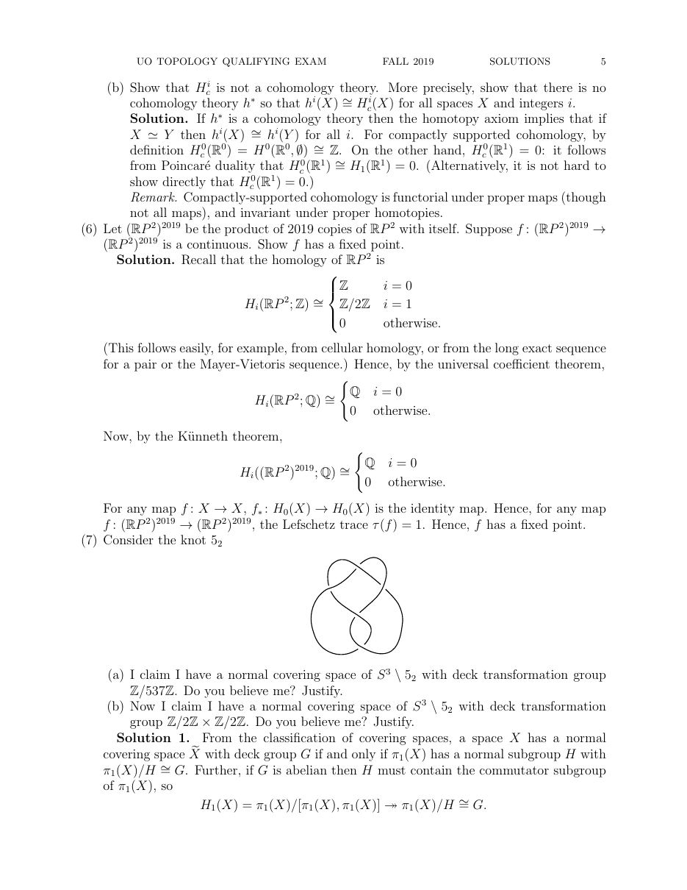

::: {.problem}
Consider the knot $5_2$.

(a) Could $S^3\setminus 5_2$ have a normal covering space with deck transformation group $\mathbb Z/537\mathbb Z$? Justify your answer.

(b) Could it have a normal covering space with deck transformation group $\mathbb Z/2\mathbb Z\times\mathbb Z/2\mathbb Z$? Justify your answer.
:::
