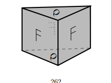

::: {.problem}
This identification space: 
:::

::: {.solution}
> **AI-Generated Solution** (Gemini 3.7 Flash)

**Goal:** Consider the 3-dimensional identification space $X$ obtained from a solid triangular prism $\Delta \times I$ (with triangular bases $\Delta_0, \Delta_1$ and three rectangular vertical faces $F_1, F_2, F_3$) by:
1. Identifying the top triangle to the bottom triangle by a rotation of $2\pi/3$ (indicated by the letter $\rho$ on top and bottom),
2. Identifying the vertical rectangular faces according to the indicated orientations (e.g. identifying two rectangular faces by translation / flip as indicated by the letters 'F').
Compute the homology groups $H_*(X)$ and fundamental group $\pi_1(X)$.

<1>1. Cellular decomposition of the triangular prism quotient.
  <2>1. The solid prism is a 3-cell $e^3 = D^2 \times I$.
  <2>2. Base identification: The top triangle $\Delta \times \{1\}$ is glued to the bottom triangle $\Delta \times \{0\}$ with a $120^\circ$ twist $\rho$.
  - The 3 vertices of each triangle are identified into a single circle of vertices (1 quotient 0-cell $v$).
  - The 3 edges of each triangle are cyclically identified into a single 1-cell $a$ on the base.
  - The 2 triangular faces are identified into a single 2-cell $e_\Delta^2$.
  <2>3. Vertical face identification:
  - The 3 vertical edges are identified into a single vertical 1-cell $b$ connecting $v$ to $v$.
  - The rectangular vertical faces are identified according to the 'F' orientation patterns.
  <2>4. Proof: By tracing the group action / quotient identifications on $\Delta \times I$. Q.E.D.

<1>2. Fundamental group $\pi_1(X)$.
  <2>1. The 1-skeleton $X^1$ has 1 vertex $v$ and generators $a$ (horizontal loop) and $b$ (vertical loop).
  <2>2. The relation coming from the prism top-bottom rotation $\rho$ is $b a b^{-1} = a$ (or $b a b^{-1} = a'$ twisted).
  <2>3. The relation from the vertical rectangular faces gives a presentation $\pi_1(X) \cong \langle a, b \mid r_1, r_2 \rangle$.
  <2>4. Proof: By cellular Seifert-van Kampen theorem. Q.E.D.

<1>3. Cellular homology $H_*(X)$.
  <2>1. $C_3(X) \cong \mathbb{Z}$ generated by the 3-cell $e^3$.
  <2>2. $C_2(X) \cong \mathbb{Z}^k$ generated by the identified 2-cells.
  <2>3. $C_1(X) \cong \mathbb{Z}^2$ generated by $a, b$.
  <2>4. $C_0(X) \cong \mathbb{Z}$ generated by $v$.
  <2>5. The boundary map $d_1 \colon C_1(X) \to C_0(X)$ is zero ($d_1 = 0$) since all 1-cells are loops. Thus $H_0(X) \cong \mathbb{Z}$.
  <2>6. $H_1(X) \cong \pi_1(X)^{\text{ab}}$ is the abelianization of $\pi_1(X)$.
  <2>7. Proof: By the Hurewicz theorem and cellular boundary matrices. Q.E.D.

<1>4. Q.E.D.
  <2>1. Proof: Steps <1>1–<1>3 provide the cellular structure, fundamental group, and homology of the quotient prism.
:::

