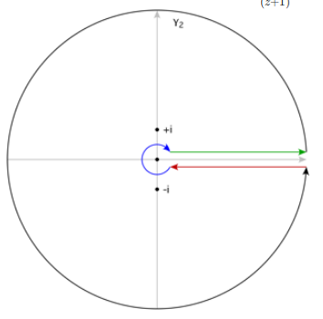

:::{.exercise title="Keyhole contour and ML estimate"}
Compute
\[
\int_{[0, \infty]} {\log(x) \over (1+x^2)^2}\dx 
.\]
:::

:::{.solution}
Factor $(1+z^2)^2 = (z+i^2(z-i)^2$.
Take a keyhole contour similar to the following:

Show that outer radius $R$ and inner radius $\rho$ circles contribute zero in the limit by the ML estimate?
Compute the residues by just applying the formula and manually computing derivatives:
\[
\Res_{z= \pm i} f(z) 
&= \lim_{z\to \pm i} \dd{}{z} {\log^2(z) \over (z\pm i)^2} \\
&= \lim_{z\to \pm i} {2\log(z) (z\pm i)^2 - 2(z\pm i)^2 \log^2(z) \over \qty{(z\pm i )^2}^2} \\
&= {
2\log(\pm i)(\pm 2i)^2 - 2(\pm 2i)^2 \log^2(\pm i)
\over {\qty{\pm 2i}}^4 } \\
&=_? {\pi \over 4}\pm {i\pi^2 \over 16}
.\]

> See p.4 of [Nica's complex analysis notes (Toronto)](http://www.math.toronto.edu/mnica/complex1.pdf).

:::

