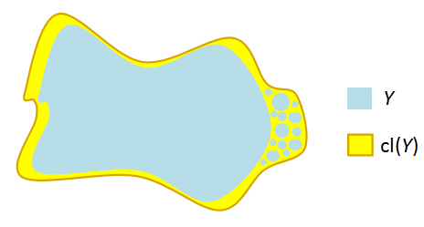

:::{.problem title="?"}
If $X$ is a topological space and $S \subset X$, define in terms of
open subsets of $X$ what it means for $S$ **not** to be connected. 

Show that if $S$ is not connected there are nonempty subsets $A, B \subset X$ 
such that 
$$
A \cup B = S \qtext{and} A \cap \bar B = \bar A \cap B = \emptyset
$$ 

> Here $\bar A$ and $\bar B$ denote closure with respect to the topology on the ambient space $X$.

:::

:::{.concept}
\envlist
- Topic: closure and connectedness in the subspace topology.
    - See Munkres p.148
:::

:::{.concept}
\envlist
- Lemma: $X$ is connected iff the only subsets of $X$ that are closed and open are $\emptyset, X$.
:::

:::{.solution}
\envlist

:::{.proof title="Variant 1"}
\envlist

- $S\subset X$ is **not ** connected if $S$ with the subspace topology is not connected.
  - I.e. there exist $A, B \subset S$ such that 
    - $A, B \neq \emptyset$,
    - $A\intersect B = \emptyset$,
    - $A \disjoint B = S$.
- Or equivalently, there exists a nontrivial $A\subset S$ that is clopen in $S$.

Show stronger statement: this is an iff.

$\implies$:

- Suppose $S$ is not connected; we then have sets $A \union B = S$ from above and it suffices to show $\cl_Y(A) \intersect B = A \intersect \cl_X(B) = \emptyset$. 
- $A$ is open by assumption and $Y\setminus A = B$ is closed in $Y$, so $A$ is clopen.
- Write $\cl_Y(A) \definedas \cl_X(A) \intersect Y$.
- Since $A$ is closed in $Y$, $A = \cl_Y(A)$ by definition, so $A = \cl_Y(A) = \cl_X(A) \intersect Y$.
- Since $A\intersect B = \emptyset$, we then have $\cl_Y(A) \intersect B = \emptyset$.
- The same argument applies to $B$, so $\cl_Y(B) \intersect A = \emptyset$.

$\impliedby$:

- Suppose displayed condition holds; given such $A, B$ we will show they are clopen in $Y$.
- Since $\cl_Y(A) \intersect B = \emptyset$, (claim) we have $\cl_Y(A) = A$ and thus $A$ is closed in $Y$.
  - Why?
  \begin{align*}
  \cl_Y(A) &\definedas \cl_X(A) \intersect Y \\ 
  &= \cl_X(A) \intersect \qty{A\disjoint B} \\ 
  &= \qty{\cl_X(A) \intersect A} \disjoint \qty{\cl_X(A) \intersect B} \\
  &= A  \disjoint \qty{\cl_X(A) \intersect B} 
  \quad\text{since } A \subset \cl_Y(A) \\
  &= A \disjoint \qty{\cl_Y(A) \intersect B} 
  \quad \text{since } B \subset Y \\
  &= A \disjoint \emptyset \quad\text{using the assumption} \\
  &= A
  .\end{align*}
- But $A = Y\setminus B$ where $B$ is closed, so $A$ is open and thus a nontrivial clopen subset.

:::

:::{.proof title="Variant 2"}
\envlist

If $S\subset X$ is not connected, then there exists a subset $A\subset S$ that is both open and closed in the subspace topology, where $A\neq \emptyset, S$.

Suppose $S$ is not connected, then choose $A$ as above.
Then $B = S\setminus A$ yields a pair $A, B$ that disconnects $S$.
Since $A$ is closed in $S$, $\bar A = A$ and thus $\bar A \cap B = A \cap B = \emptyset$.
Similarly, since $A$ is open, $B$ is closed, and $\bar B = B \implies \bar B \cap A = B \cap A = \emptyset$.

:::

:::
