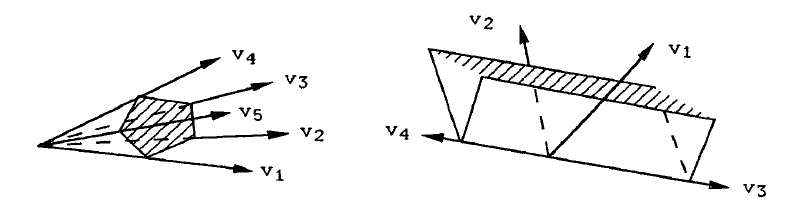

::: {.definition title="The lattices"}
For the torus $T = \GG_m^n$, the \dfn{character lattice} is $M = \Hom(T, \GG_m) \cong \ZZ^n$, with $\chi^m(t) = \prod t_i^{m_i}$, and the **cocharacter lattice** is $N = \Hom(\GG_m, T)$.
The pairing $\inp{m}{u}$ is the integer $\ell$ with $\chi^m \circ \lambda^u : t \mapsto t^\ell$.
:::

::: {.definition title="Cones and fans"}
A cone $\sigma \subseteq N_\RR$ is \dfn{strongly convex rational polyhedral} if it is generated by finitely many lattice vectors and contains no line.
Its dual is $\sigma\dual = \ts{m \in M_\RR \st \inp{m}{u} \geq 0 \text{ for all } u \in \sigma}$.
A **fan** $\Sigma$ is a finite collection of such cones closed under faces, in which any two cones meet in a face of each.
:::

::: {.example title="Cones with many edges"}
A cone in $\RR^3$ can have any number of edges; the cross-sections below have five edges $v_1, \ldots, v_5$ and four edges $v_1, \ldots, v_4$.

{width=550px}
:::

::: {.example title="The projective line"}
The fan $\ts{\RR_{\geq 0}, \ts{0}, \RR_{\leq 0}}$ in $N_\RR = \RR$ gives two copies of $\CC$ glued along $\CC^\times$ by $x \mapsto x^{-1}$:

\begin{tikzcd}
	{\CC[x^{-1}]} & {\CC[x, x^{-1}]} & {\CC[x]} \\
	\CC & {\CC^\times} & \CC
	\arrow[hook, from=1-1, to=1-2]
	\arrow[hook', from=1-3, to=1-2]
	\arrow[hook', from=2-2, to=2-1]
	\arrow[hook, from=2-2, to=2-3]
\end{tikzcd}

so $X_\Sigma = \PP^1$.
:::

::: {.definition title="The variety"}
\[
\sigma \rightsquigarrow S_\sigma = \sigma\dual \intersect M \rightsquigarrow U_\sigma = \Spec k[S_\sigma] ,
\]
and $X_\Sigma$ is obtained by gluing the $U_\sigma$ along the $U_{\sigma \intersect \tau}$.
:::

::: {.remark}
Gordan's lemma is what makes this work: $S_\sigma$ is a finitely generated semigroup, so $k[S_\sigma]$ is a finitely generated algebra and $U_\sigma$ is an honest affine variety.

The construction is a dictionary in which every question becomes finite combinatorics.
The cone $\ts{0}$ gives the torus itself, the cone spanned by a basis gives $\AA^n$, and the fan of $\PP^n$ has rays $e_1,\ldots,e_n$ and $-\sum e_i$.
The cone spanned by $(0,1)$ and $(d,-1)$ gives the cone over the rational normal curve of degree $d$, which is the standard source of an example with prescribed bad behaviour.
:::
