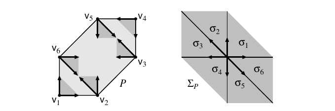

::: {.definition title="Faces"}
Let $P \subseteq M_\RR$ be a lattice polytope.
A face is a slice by a supporting affine hyperplane,
\[
F = P \intersect \ts{m \in M_\RR \st \inp{m}{u} = r}, \qquad \inp{m}{u} \geq r \text{ on } P ,
\]
for some $u \in N$ and $r \in \RR$.
The facets are the faces of codimension one, and $P$ has the facet presentation
\[
P = \ts{ m \in M_\RR \st \inp{m}{u_F} \geq -a_F \text{ for every facet } F } ,
\]
where $u_F \in N$ is the primitive inward normal to $F$.
:::

::: {.definition title="The normal fan"}
For a face $F \leq P$ set
\[
\sigma_F = \Cone\big( u_F' \st F \leq F',\ F' \text{ a facet} \big) \subseteq N_\RR .
\]
These cones form the \dfn{normal fan} $\Sigma_P$, and $X_P \da X_{\Sigma_P}$.
Vertices of $P$ give the maximal cones, facets of $P$ give the rays, and the whole poset is reversed.
The vertex $m_i$ corresponds to the maximal cone $\sigma_i = \Cone(P \cap M - m_i)\dual$.
:::

::: {.definition title="Combinatorial equivalence"}
Polytopes $P_1$ and $P_2$ are \dfn{combinatorially equivalent} if there is a bijection between their faces that preserves inclusions, intersections and dimensions of faces.
:::

::: {.example title="A hexagon"}
For the hexagon $P$ with vertices $v_1, \ldots, v_6$, the cone of directions out of each vertex $v_i$ is dual to the maximal cone $\sigma_i$ of the normal fan $\Sigma_P$, which has six maximal cones.

{width=550px}
:::

::: {.remark title="Three descriptions, one variety"}
The same $X_P$ arises three ways, and an examiner may ask for any of them.

1. The normal fan, as above.

2. Cones over the proper faces of the polar dual $P^\circ$ — the normal fan of $P$ is the fan of cones over faces of $P^\circ$.

3. A direct gluing: $X_P = \Union_{m \in P \intersect M} \Spec k[\sigma_{\hat m}\dual \intersect M]$ with $\sigma_{\hat m} = \Cone(P \intersect M - m)$, the cone of directions out of the vertex $m$.

Only the first two are worth memorising; the third is what the first two are secretly doing.
:::

::: {.remark}
$X_P$ comes with an ample divisor by construction, so every $X_P$ is projective.
This is the source of the standard warning: a complete fan need not come from a polytope, and a complete toric variety need not be projective.
:::
