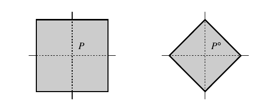

::: {.definition title="Polar dual"}
For $P \subseteq M_\RR$ containing the origin in its interior,
\[
P^\circ = \ts{ u \in N_\RR \st \inp{m}{u} \geq -1 \text{ for all } m \in P } .
\]
:::

::: {.proposition title="Polar dual from the facet presentation"}
If $0$ is in the interior of $P$ and $P = \ts{ m \in M_\RR \st \inp{m}{u_F} \geq -a_F \text{ for every facet } F }$, then every $a_F > 0$ and
\[
P^\circ = \operatorname{Conv}\qty( a_F^{-1} u_F \st F \text{ a facet of } P ) .
\]
:::

::: {.example title="The square"}
The square $P = \ts{ m \st \inp{m}{\pm e_i} \geq -1 }$ has $a_F = 1$ for all four facets, so $P^\circ = \operatorname{Conv}(\pm e_1, \pm e_2)$ is the diamond.

{width=400px}
:::

::: {.definition title="Reflexive"}
$P$ is \dfn{reflexive} if it is a lattice polytope with facet presentation
\[
P = \ts{ m \in M_\RR \st \inp{m}{u_F} \geq -1 \text{ for every facet } F } ,
\]
that is, every facet lies at lattice distance $1$ from the origin.
Then $P^\circ = \operatorname{Conv}(u_F \st F \text{ a facet of } P)$ is again a lattice polytope, and $(P^\circ)^\circ = P$.
:::

::: {.theorem}
$X_P$ is Gorenstein Fano — $-K_X$ Cartier and ample — exactly when $P$ is reflexive, and then $P_{-K_{X_P}} = P$.
$X_P$ is smooth Fano exactly when $P^\circ$ is a **smooth polytope**: each vertex meets exactly $n = \dim M$ edges, and the primitive vectors along those edges form a lattice basis.
:::

::: {.remark}
In dimension two there are $16$ reflexive polygons up to equivalence, hence $16$ Gorenstein Fano toric surfaces.
Exactly five of them are smooth, giving the toric del Pezzo surfaces:
\[
\PP^2, \quad \PP^1 \times \PP^1, \quad \Bl_1 \PP^2, \quad \Bl_2 \PP^2, \quad \Bl_3 \PP^2 ,
\]
the last three obtained by blowing up the torus-fixed points of $\PP^2$ one at a time.
The list stops at three because a fourth blowup destroys ampleness of $-K$: the fan acquires two adjacent rays whose walls no longer crease.
:::
