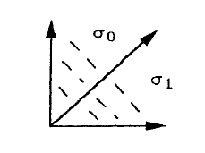

::: {.example title="Star subdivision"}
Let $\sigma = \Cone(u_1, \ldots, u_k)$ be a smooth cone of $\Sigma$, with distinguished fixed point $x_\sigma$.
Insert the ray $u_0 = u_1 + \cdots + u_k$ and replace $\sigma$ by the cones spanned by $u_0$ together with each proper face of $\sigma$.
The identity map of $N$ is compatible with the new fan and the old, and the induced morphism
\[
\Bl_{x_\sigma} X_\Sigma = X_{\Sigma'} \to X_\Sigma
\]
is the blowup at $x_\sigma$, with exceptional divisor $D_{u_0} \cong \PP^{k-1}$.
:::

::: {.example title="Blowing up the affine plane"}
Subdivide the first quadrant by the ray through $e_1 + e_2$, giving $\sigma_0 = \Cone(e_2, e_1 + e_2)$ and $\sigma_1 = \Cone(e_1 + e_2, e_1)$:

{width=200px}

Then $U_{\sigma_0} = \Spec \CC[x, x^{-1}y]$ and $U_{\sigma_1} = \Spec \CC[y, xy^{-1}]$, both copies of $\CC^2$.
The blowup of $\CC^2$ at the origin is $\Bl_0 \CC^2 = V(x t_1 - y t_0) \subseteq \CC^2 \times \PP^1$ with $\PP^1 = \ts{[t_0 : t_1]}$, covered by $U_i = D(t_i) \cong \CC^2$ with coordinates $x, t_1/t_0 = x^{-1}y$ on $U_0$ and $y, t_0/t_1 = xy^{-1}$ on $U_1$.
These are the two charts above, glued the same way, so $X_{\Sigma} = \Bl_0 \CC^2$.
:::

::: {.example title="Blowing up the plane"}
$\PP^2$ has rays $(1,0), (0,1), (-1,-1)$.
Blow up the fixed point of $\sigma = \Cone\big((1,0),(0,1)\big)$ by inserting $(1,0) + (0,1) = (1,1)$.
The new fan has rays in counterclockwise order
\[
(1,0), \quad (1,1), \quad (0,1), \quad (-1,-1) .
\]
Now read the relations $u_{i-1} + u_{i+1} = a_i u_i$:
\[
(1,0) + (0,1) = (1,1) \rightsquigarrow a = 1, \quad
(-1,-1) + (1,1) = (0,0) \rightsquigarrow a = 0 ,
\]
\[
(1,1) + (-1,-1) = (0,0) \rightsquigarrow a = 0, \quad
(0,1) + (1,0) = (1,1) = -1 \cdot (-1,-1) \rightsquigarrow a = -1 .
\]
The self-intersections $-a_i$ are therefore
\[
E^2 = D_{(1,1)}^2 = -1, \qquad D_{(1,0)}^2 = D_{(0,1)}^2 = 0, \qquad D_{(-1,-1)}^2 = 1 .
\]
:::

::: {.remark}
Every number is the expected one.
$E$ is a $(-1)$-curve.
The two lines through the blown-up point become their strict transforms $L - E$ with self-intersection $1 - 1 = 0$.
The third line misses the point and keeps $L^2 = 1$.
Four rays with a $-1$ among the self-intersections identifies the surface as $\FF_1$.

The sum rule holds: $\sum a_i = 1 + 0 + 0 - 1 = 0 = 3 \cdot 4 - 12$.
Blowing up adds one ray, so it raises $\rank \Pic$ by one and $\chi$ by one, both visible on the picture.
:::
