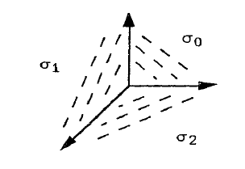
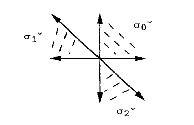

::: {.example title="The fan"}
$N = \ZZ^2$ with rays $u_1 = e_1$, $u_2 = e_2$, $u_0 = -e_1 - e_2$, and the three two-dimensional cones spanned by consecutive pairs.
Each is smooth, the support is all of $N_\RR$, so $\PP^2$ is smooth and complete, with $\chi = \size\Sigma(2) = 3$.

{width=250px}
:::

::: {.example title="The charts"}
Let $\sigma_0 = \Cone(e_1, e_2)$, $\sigma_1 = \Cone(e_2, -e_1-e_2)$, $\sigma_2 = \Cone(-e_1-e_2, e_1)$. Their duals are

{width=300px}

and each $U_{\sigma_i} \cong \CC^2$, with coordinates
\[
U_{\sigma_0} : (x, y), \qquad U_{\sigma_1} : (x^{-1}, x^{-1}y), \qquad U_{\sigma_2} : (y^{-1}, xy^{-1}) .
\]
Setting $x = t_1/t_0$ and $y = t_2/t_0$ identifies $U_{\sigma_i}$ with the standard chart $\ts{t_i \neq 0}$ of $\PP^2$, and the gluings agree.
:::

::: {.example title="Class group"}
The map $M \to \ZZ^3$ is $m \mapsto (\inp{m}{u_1}, \inp{m}{u_2}, \inp{m}{u_0})$, with matrix rows $(1,0), (0,1), (-1,-1)$.
The cokernel is $\ZZ$ via $(a_1, a_2, a_0) \mapsto a_1 + a_2 + a_0$, since $e_1 \mapsto (1,0,-1)$ and $e_2 \mapsto (0,1,-1)$ both have coordinate sum $0$.
So $\Cl(\PP^2) = \ZZ$, all three $D_i$ map to $1$, and $D_1 \sim D_2 \sim D_0 = H$ — the three coordinate lines.
:::

::: {.example title="Anticanonical polytope"}
$K_X = -(D_0 + D_1 + D_2) = -3H$, so $-K_X = 3H$ and
\[
P_{-K} = \ts{ m \st m_1 \geq -1,\ m_2 \geq -1,\ -m_1 - m_2 \geq -1 } = \operatorname{Conv}\big( (-1,-1),\ (2,-1),\ (-1,2) \big) ,
\]
the triangle $3\Delta$ translated to have the origin in its interior.
Counting its lattice points gives $1 + 2 + 3 + 4 = 10 = h^0(\OO(3))$, which is the dimension of the space of plane cubics.
Its polar dual is $\operatorname{Conv}\big( (1,0), (0,1), (-1,-1) \big)$, the convex hull of the ray generators, so $P_{-K}$ is reflexive.
:::

::: {.remark}
$-K_X = 3H$ is Cartier and ample, so $\PP^2$ is Fano, and the whole verification was three rays and a lattice-point count.
Replacing $-K$ by $D = dH$ gives $P_D = d\Delta$ with $\binom{d+2}{2}$ lattice points, reproducing $h^0(\PP^2, \OO(d))$ without a single cohomology computation.
:::
