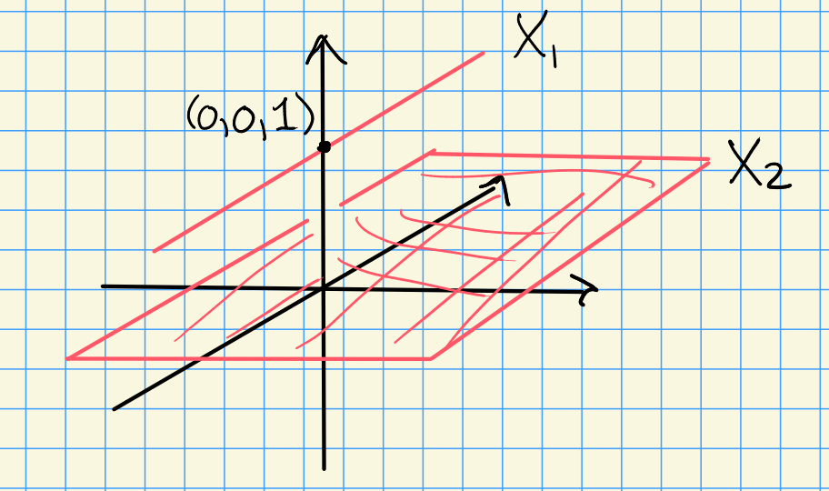

::: {.example}
A disjoint union of closed subsets of $\AA^n$ has coordinate ring the product of their coordinate rings.
In $\AA^3_\CC$ with coordinates $x, y, z$, let $X_1 = V(x, z-1)$ be the line through $(0,0,1)$ parallel to the $y$-axis, let $X_2 = V(z)$ be the $xy$-plane, and let $X = X_1 \cup X_2$.

{width=350px}

1. $I(X) = I(X_1) \cap I(X_2) = (x, z-1) \cap (z)$.
   The ideals are comaximal, since $z - (z-1) = 1$ lies in their sum, so their intersection equals their product:
   $$I(X) = (x, z-1) \cdot (z) = (xz, z^2 - z).$$

2. By the Chinese remainder theorem for the comaximal ideals $(x, z-1)$ and $(z)$,
   $$\CC[X] = \frac{\CC[x,y,z]}{(xz, z^2-z)} \cong \frac{\CC[x,y,z]}{(x, z-1)} \times \frac{\CC[x,y,z]}{(z)} \cong \CC[y] \times \CC[x,y].$$

3. The idempotent $z \in \CC[X]$ is $1$ on $X_1$ and $0$ on $X_2$, and $z(z-1) = 0$ in $\CC[X]$ with $z, z - 1 \neq 0$.
   So $\CC[X]$ is not a domain, matching the reducibility of $X$ in [[PR-7OT2Z]].
:::
