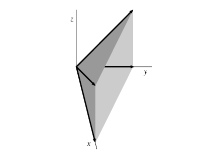

::: {.theorem title="The two sequences"}
Let $\Sigma$ have rays $\Sigma(1)$ with primitive generators $u_\rho$.
Each ray $\rho$ gives a prime divisor $D_\rho$, the closure of the corresponding codimension-one orbit, and
\[
\Div_T(X_\Sigma) = \bigoplus_{\rho \in \Sigma(1)} \ZZ D_\rho \cong \ZZ^{\Sigma(1)} .
\]
There are exact sequences
\[
M \to \bigoplus_{\rho} \ZZ D_\rho \to \Cl(X_\Sigma) \to 0 ,
\qquad
M \to \CDiv_T(X_\Sigma) \to \Pic(X_\Sigma) \to 0 ,
\]
compatible with the inclusions $\CDiv_T \subseteq \Div_T$ and $\Pic \subseteq \Cl$.
The left map is
\[
m \mapsto \operatorname{div}(\chi^m) = \sum_{\rho \in \Sigma(1)} \inp{m}{u_\rho} D_\rho ,
\]
whose kernel is $M \cap \bigcap_\rho u_\rho^\perp$.
It is injective, so both sequences are short exact, exactly when the $u_\rho$ span $N_\RR$, that is, when $X_\Sigma$ has no torus factor.
[@Ful93, §3.3]
:::

::: {.proposition title="Cartier divisors as a limit over the fan"}
Order $\Sigma$ by inclusion of faces and let $M(\sigma) = \sigma^\perp \cap M$.
Restriction to the affine opens $U_\sigma$ identifies
\[
\CDiv_T(X_\Sigma) \cong \varprojlim_{\sigma \in \Sigma} M/M(\sigma) ,
\]
the inverse limit over the face poset of the groups $\CDiv_T(U_\sigma) \cong M/M(\sigma)$ of local data $m_\sigma$.
:::

::: {.theorem title="Quotient construction"}
Suppose the $u_\rho$ span $N_\RR$.
Let $S = \CC[x_\rho : \rho \in \Sigma(1)]$, for $\sigma \in \Sigma$ let $x^{\hat\sigma} = \prod_{\rho \notin \sigma(1)} x_\rho$, and let $B(\Sigma) = \gens{x^{\hat\sigma} : \sigma \in \Sigma}$ be the irrelevant ideal, generated by the $x^{\hat\sigma}$ for maximal $\sigma$.
Then $Z(\Sigma) = V(B(\Sigma)) \subseteq \CC^{\Sigma(1)}$ is a union of coordinate subspaces of codimension at least $2$.
Applying $\Hom_\ZZ(-, \CC^\times)$ to $0 \to M \to \ZZ^{\Sigma(1)} \to \Cl(X_\Sigma) \to 0$ gives
\[
1 \to G \to (\CC^\times)^{\Sigma(1)} \to T_N \to 1 , \qquad G = \Hom_\ZZ(\Cl(X_\Sigma), \CC^\times) ,
\]
and $X_\Sigma$ is the good categorical quotient $\qty(\CC^{\Sigma(1)} \sm Z(\Sigma)) /\!\!/ G$.
It is a geometric quotient if and only if $\Sigma$ is simplicial.

A **primitive collection** is a subset $C \subseteq \Sigma(1)$ not contained in $\sigma(1)$ for any $\sigma \in \Sigma$, every proper subset of which is contained in some $\sigma(1)$; then $Z(\Sigma) = \bigcup_C V(x_\rho : \rho \in C)$ over the primitive collections.
:::

::: {.example title="The cone over the quadric surface"}
Let $\sigma = \Cone(e_1, e_2, e_1 + e_3, e_2 + e_3) \subseteq \RR^3$, a cone with four edges, so not simplicial, and $X_\sigma = V(xz - yw) \subseteq \CC^4$, the affine cone over $\PP^1 \times \PP^1$.

{width=250px}

Here
\[
\Cl(X_\sigma) = \operatorname{coker}\qty( \ZZ^3 \xrightarrow{A} \ZZ^4 ) = \ZZ ,
\qquad
A = \begin{bmatrix} 1 & 0 & 0 \\ 0 & 1 & 0 \\ 1 & 0 & 1 \\ 0 & 1 & 1 \end{bmatrix} ,
\]
generated by $D_\rho$ for any ray $\rho$, while $\Pic(X_\sigma) = 0$ because $X_\sigma$ is affine.
:::

::: {.example}
For $\PP^n$, with rays $e_1, \ldots, e_n$ and $e_0 = -\sum_i e_i$, the only primitive collection is $\ts{e_0, \ldots, e_n}$, so $Z = \ts{0}$, and $G = \CC^\times$ acts on $\CC^{n+1}$ by $\lambda \cdot (x_0, \ldots, x_n) = (\lambda x_0, \ldots, \lambda x_n)$, recovering $\PP^n = (\CC^{n+1} \sm \ts{0})/\CC^\times$.
:::

::: {.theorem title="Canonical divisor"}
$\omega_{X_\Sigma} \cong \OO\big( -\sum_\rho D_\rho \big)$, so $K_X \sim -\sum_{\rho \in \Sigma(1)} D_\rho$.
:::

::: {.remark}
So the class group is the cokernel of an explicit integer matrix whose rows are the ray generators.
Two consequences are immediate.
It has rank $\size \Sigma(1) - \dim N_\RR$, and it has torsion exactly when the rays fail to generate $N$ as a lattice.
When $\Sigma$ is simplicial, $\Pic$ has finite index in $\Cl$ and $\rank \Pic(X_\Sigma) = \size \Sigma(1) - \dim N_\RR$ as well — for $\FF_a$ this is $4 - 2 = 2$, a fibre and a section.

Cartier divisors are cut out locally: $D = \sum a_\rho D_\rho$ is Cartier iff for every maximal cone $\sigma$ there is $m_\sigma \in M$ with $\inp{m_\sigma}{u_\rho} = -a_\rho$ for all $\rho \leq \sigma$, and then $D|_{U_\sigma} = \operatorname{div}(\chi^{-m_\sigma})$.
Equivalently $\CDiv_T(U_\sigma) \cong M/M(\sigma)$ where $M(\sigma) = \sigma^\perp \intersect M$.

For $\PP^n$ the $n+1$ rays give $D_0, \ldots, D_n$, all linearly equivalent, so $K_{\PP^n} \sim -(n+1)H$ and $\omega_{\PP^n} = \OO(-n-1)$ falls out of counting rays.
:::
