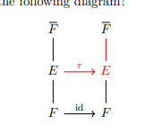

:::{.definition title="Galois Extension and Galois Group"}
Let $L/k$ be a finite field extension.
The following are equivalent:

- \( L/k \) is a **Galois extension**.
- $L$ is normal, and separable.
- The fixed field $L^H$ of $H\da \mathrm{Aut}(L/k)$ is exactly $k$.
- $L$ is the splitting field of a separable polynomial $p\in K[x]$.
- $L$ is a finite separable splitting field of an irreducible polynomial.
- There is a numerical equality:
\[
\size \Aut_{\Fieldsover{k}} (L) = [L: k] = \ts{ L: k}
,\]
  where $\ts{E:F}$ is the number of isomorphisms to any field lifting $\id_F$:

In this case, we define the **Galois group** as 
\[
\Gal(L/k) \definedas \Aut_{\Fieldsover{k}} (L/k)
.\]
:::
