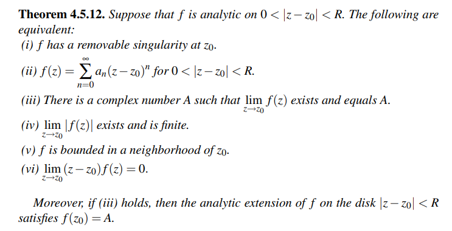

:::{.definition title="Removable Singularities"}
If $z_0$ is a singularity of $f$. then $z_0$ is a **removable singularity** iff
there exists a holomorphic function $g$ such that $f(z) = g(z)$ in a punctured neighborhood of $z_0$.
Equivalently,
\[
\lim_{z\to z_0}(z-z_0) f(z) = 0
.\]
Equivalently, $f$ is bounded on a neighborhood of $z_0$.
Equivalently, $v_{z_0}(f) \geq 0$

:::
