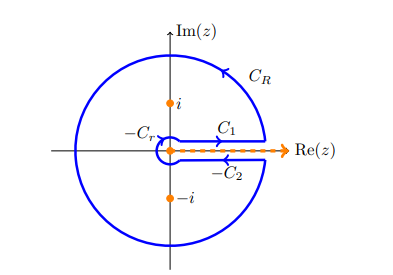

:::{.exercise title="$x^? / 1+x^2$"}
\[
I\da \int_0^\infty {x^{1\over 3} \over 1 + x^2} \dx = {\pi \over \sqrt 3}
.\]

:::

:::{.solution title="Semicircle monodromy"}
Write $f(z) \da {z^{1\over 3}\over z^2+1}$, the claim is that an indented semicircular contour will work:

Why:
after parameterizing $C_R$, the integrand is approximately $R\cdot R^{1\over 3}/ R^2 \sim R^{{4\over 3} - 2} = R{-{2\over 3}}$, which goes to zero as $R\to \infty$.
Similarly, on $C_\eps$, the integrand is approximately $\eps^{4\over 3}/(\eps^2+1)$, which goes to zero as $\eps\to 0$.

Note the poles at $z=\pm i$.
Computing the residue contribution at $z=i$:
\[
\Res_{z=i} f(z) &= {i^{1\over 3} \over 2i} = {1\over 2e^{i\pi \over 3}}
.\]

Computing the contribution from the integrals: let $\gamma_1$ be the contour along $\RR_{\geq \eps}$, and $\gamma_2$ along $\RR_{\leq \eps}$.
Noting that $I = \int_{\gamma_1}f(z)\dz$,
\[
\int_{\gamma_2}f(z)\dz 
&= \int_{-R}^{-\eps} { t^{1\over 3} \over t^2 +1 } \dt \\
&= -\int_R^\eps {(-x)^{1\over 3} \over x^2+1}\dx \qquad x=-t,\, \dx = -\dt \\
&= \int_\eps^R {(\zeta_2 x)^{1\over 3} \over x^2+1}\dx \\
&= \zeta_2^{1\over 3} I \\
&= e^{i\pi\over 3}I
,\]
so $\qty{\int_{\gamma_1} + \int_{\gamma_2}} f$ contributes $(1+e^{i\pi \over 3})I$.
By the residue theorem,
\[
2\pi i \cdot
{1\over 2e^{i\pi \over 3} }
&=
(1+e^{i\pi \over 3})I \\ \\
\implies
I 
&= {i\pi \over 2e^{i\pi \over 3} (1+e^{i\pi \over 3}) } \\
&= {i\pi \over 2} \qty{ e^{i\pi \over 3} + e^{2i\pi \over 3} }\inv \\
&= {i\pi \over 2} \qty{ e^{i\omega} + e^{2i\omega} }\inv,\qquad \omega={\pi\over 3} \\
&= {i\pi \over 2} \qty{ e^{3i\omega\over 2} \qty{ e^{-i\omega\over 2} + e^{i\omega\over 2}} }\inv \\
&= i\pi e^{-3i\omega\over 2}{1\over \cos\qty{\omega\over 2}} \\
&= i\pi e^{-i\pi\over 2 }{1\over \cos\qty{\pi \over 6}} \\
&= {\pi \over \sqrt{3}}
,\]
where we've used the "exponential balancing trick" (see complex arithmetic section).
:::

:::{.solution title="Keyhole monodromy"}
For the same reasons as in the semicircular solution, a keyhole will work:

The contributions from $C_2$: 
\[
\int_{C_2}f(z) \dz 
&= \int_R^\eps { (t-i\eps)^{1\over 3} \over (t-i\eps)^2 + 1 }\dt \\
&= - \int^R_\eps { e^{{1\over 3}\qty{\ln\abs{t-i\eps} + i\Arg(t-i\eps) } } \over (t-i\eps)^2 + 1 }\dt \\
&\to - \int^R_\eps { e^{{1\over 3}\qty{\ln\abs{t} + 2\pi i } } \over t^2 + 1 }\dt \\
&= -\int_\eps^R { e^{2\pi i \over 3} t^{1\over 3} \over t^2 + 1}\dt \\
&= - \zeta_3 I
,\]
so the contributions from the contours sums to $(1-\zeta_3 I)$.

The contributions from residues:
\[
\Res_{z=\pm i} f(z)
&= { (\pm i)^{1\over 3} \over \pm 2i} \cdot \\ 
&= { (e^{k\pi \over 2})^{1\over 3} \over \pm 2i},\qquad k=1,3\\ 
&= { e^{k\pi \over 6} \over \pm 2i} \\
&=
\begin{cases}
 { e^{\pi\over 6} \over 2i} &  z=i
\\
 {e^{3\pi \over 6} \over -2i} = -{1\over 2} & z=-i.
\end{cases}
.\]
So the contribution from the residue theorem is
\[
2\pi i\qty{ {e^{\pi\over 6} \over 2i} - {i\over 2i} } = \pi\qty{e^{\pi\over 6} - 1}
.\]

Solving for the integral:
\[
I 
&= {\pi (e^{\pi \over 6} - i) \over 1 - e^{2i\pi \over 3}} \\
&=\pi { e^{i\omega} - e^{3i\omega} \over e^{0i\omega} - e^{4i\omega}},\qquad \omega = {\pi\over 6} \\
&= \pi {e^{2i\omega} \qty{e^{-i\omega} - e^{i\omega} } \over e^{2i\omega}\qty{e^{-2i\omega} - e^{2i\omega} } } \\
&= \pi {-2i\sin(\omega) \over -2i\sin(2\omega)} \\
&= \pi {\sin\qty{\pi\over 6} \over \sin\qty{\pi\over 3}} \\
&= \pi{ 1/2\over \sqrt{3}/2}\\
&= {\pi \over \sqrt 3} 
.\]

:::

