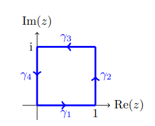

::: {.exercise}
Compute $\int_\Gamma \Re(z) \dz$ for $\Gamma$ the unit square.
:::

::: {.solution}
Write $\Gamma = \sum_{1\leq k \leq 4}\gamma_k$, starting at zero and traversing clockwise:

Compute:

- $\gamma_1$: parameterize to get $\int_0^1t1\dt = 1/2$.

- $\gamma_2$: $\int_0^1 i \dt = i$

- $\gamma_2$: $-\int_0^1 (1-t)\dt = -1/2$

- $\gamma_2$: $- \int_0^1 0 \dt = 0$

So $\int_\Gamma \Re(z) \dz = i$.
:::
