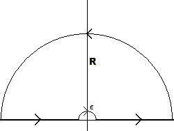

:::{.exercise title="Applying Jordan's lemma"}
Compute
\[
\int_\RR {\sin(x) \over x}\dx
.\]

:::

:::{.solution}
Note that the ML bound is not sufficient to bound a semicircular contour:
\[
\abs{\int_{C_R} { e^{iz} \over z}\dz } \leq \pi R \sup_{z\in C_R} \abs{1\over z} = \pi \not\to 0
.\]
Jordan's lemma on this contour yields
\[
\abs{\int_{C_R} {e^{iz} \over z} \dz } \leq \pi \sup_{z\in C_R}\abs{1\over Z} = {\pi \over R} \to 0
.\]

To compute the full integral, use an indented semicircular contour:

- $C_+ \da [\eps, R]$
- $C_i \da [-R, \eps]$
- $C_\eps \da \eps e^{it}$ with $t\in [0, \pi]$
- $C_R \da R e^{it}$ with $t\in [0, \pi]$
- $\Gamma \da C_+ + C_R + C_- - C_\eps$, noting that $C_\eps$ is is taken with a reversed orientation.

Write $I$ for the original integral, and
\[
f(z) \da { e^{iz} \over z} \implies I = \Im \lim_{\eps\to 0}\lim_{R\to \infty} \qty{\int_{C_-} + \int_{C_+}}f
.\]
By the residue theorem
\[
\int_\gamma f(z) \dz 
&= 2\pi i \sum_{z_k \in \HH} \Res_{z=z_k} f(z) = 0 \\
&= \qty{\int_{C_+} + \int_{C_R} + \int_{C_-} - \int_{C_\eps} }f \\
&= \tilde I + \qty{\int_{C_R} - \int_{C_\eps}}f
,\]
where $\Im(\tilde I) = I$ is the original integral, so
\[
\tilde I = -\qty{\int_{C_R} - \int_{C_\eps}}f
.\]

Since $\int_{C_R}f \to 0$, it just remains to compute $\int_{C_\eps}$.
By the fractional residue formula,
\[
\lim_{\eps \to 0} {e^{iz} \over z}\dz = i\pi \Res_{z=0} {e^{iz} \over z} = i\pi
.\]
Thus
\[
I = \Im(i\pi) = \pi
.\]
:::

