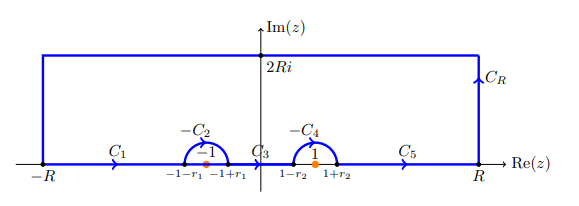

:::{.exercise title="$xe^{2ix}/x^2-1$ "}
\[
I \da \int_\RR {xe^{2ix} \over x^2-1}\dx = i\pi \cos(2)
.\]

#complex/exercise/completed

:::

:::{.solution}
Factor the denominator as $(z-1)(z+1)$, then there are two poles of order 1 on $\RR$.
Define a contour

- $C_1: [-R, 1-\eps_1]$
- $-C_2: -1 + Re^{it}, t \in [0, \pi]$ 
- $C_3: [1-\eps, 1+\eps]$
- $C_4: 1 + Re^{it}, t \in [0, \pi]$ 
- $C_R: Re^{it}, t\in [0, \pi]$
- $\Gamma = C_1 + \cdots + C_4 + C_R$

So this, but with a semicircular contour instead of a rectangle:

By Jordan's lemma, $\int_{C_R}\to 0$, and $\qty{\int_{C_2} + \int_{C_3} + \int_{C_4}}\to 0$, while $\int_\Gamma = 0$ since it encloses no singularities.
Thus
\[
0 = \int_{C_2} f + \int_{C_4} f
,\]
which converges to the fractional residues at $z=\pm 1$.

For $z=-1$,
\[
\int_{C_2} 
&\to \pi i \Res_{z=-1} f(z) \\\
&= \pi i \lim_{z\to -1} {e^{2iz} \over z-1} \\
&= \pi i {e^{-2i} \over 2}
.\]

For $z=-1$:
\[
\int_{C_4} 
&\to \pi i \Res_{z=1} f(z) \\\
&= \pi i \lim_{z\to 1} {e^{2iz} \over z+1} \\
&= \pi i {e^{2i} \over 2}
.\]

Putting it all together:
\[
I 
&= \pi i {e^{-2i} \over 2} + \pi i {e^{2i}\over 2} \\
&=\pi i \cos(2)
.\]
:::

