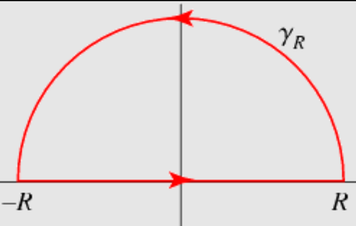
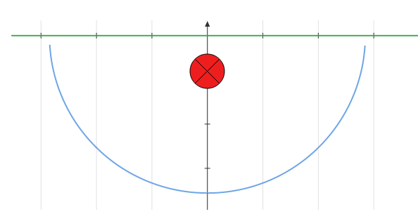

:::{.exercise title="$x\sin(x)/1+x^2$"}
\[
I = \int_\RR {x\sin(x) \over 1 + x^2}\dx
.\]

:::

:::{.solution}
Write $f(z) = {ze^{iz} \over 1+z^2}$, and note that $f\in \bigo\qty{1\over z}$, so the usual semicircular contour with the ML estimate won't work.
Claim: a semicircular contour with a better estimate *will* work:

Writing $f(z) = e^{iz}g(z)$ where $g(z) \da {z\over 1 + z^2}$, we have $g\in \bigo\qty{1\over z} \to 0$ as $\abs{z}\to \infty$, so Jordan's lemma applies.
Write $C_1 = [-R, R]$ and $C_R = \ts{Re^{it} \st t\in [0, \pi]}$, then
\[
\abs{\int_{C_R} e^{iz} g(z)\dz }\leq \pi M_R,\, \qquad M_R \da \sup_{z\in C_R}\abs{z\over 1+z^2}
.\]
Now use that ${z+1\over z^2}\leq M\abs{z}$ for $\abs{z}$ large enough to conclude this integral goes to zero.
By the residue theorem,
\[
2\pi i \sum_{z_k\in \HH}\Res_{z=z_k}f(z) = \int_{C_1 + C_R} f = \qty{\int_{C_1} + \int_{C_R}}f \converges{R\to\infty} \int_{C_1} f = I
,\]
so it suffices to compute the residues of $f$.
Check that $1+z^2 = (1+i)(1-i)$, so $z_1 = i \in \HH$ is a simple pole and
\[
2\pi i \Res_{z=i} f(z) 
&= 2\pi i \lim_{z\to i} {e^{iz} \over z+i} \\
&= 2\pi i {i\over 2ei} = {\pi \over e}
,\]
so
\[
I = {\pi \over e}
.\]
:::

:::{.exercise title="$\cos(x) / i+x$"}
\[
I \da \int_\RR {\cos(x) \over x+i}\dx
.\]

:::

:::{.solution}
Note that the usual thing won't work, since ${\cos(z) \over z+i}\neq \Re\qty{e^{iz}\over z+i};$ the complex constant in the denominator throws this off!
Instead, use $\cos(z) = {1\over 2}(e^{iz} + e^{-iz})$ to decompose into two integrals:
\[
I \da \int_\RR {\cos(z) \over z+i} 
= {1\over 2} \int_\RR {e^{iz} \over z+i} + {1\over 2}\int_\RR {e^{-iz} \over z+i} \da \int_\RR f_1 + \int_\RR f_2
,\]
These both have $\deg(f_i) = -1$, so Jordan's lemma on semicircular contours will work.
For $e^{i\alpha z}$, one needs to take the upper half-plane for $\alpha>0$ (so $f_1$) and the lower for $\alpha<0$ (for $f_2$).
For $f_1$, use the upper contour:

Then by Jordan's lemma, since $f(z) = e^{iz}g(z)$ with $g(z) \to 0$ as $\abs{z}\to \infty$, $\int_{\gamma_R} f \to 0$ and we're left with the residues in $\HH$.
Here, the only residue is at $z=-i$, so this integral is zero.
For $f_2$, use the lower contour:

This is parameterized counterclockwise, and so the piece along $\RR$ converges to $-I$.
By Jordan's lemma
\[
-I 
&= 2\pi i \Res_{z=-i} {e^{iz}\over 2(z+i)} \\
&= 2\pi i \lim_{z\to -i} {e^{iz}\over 2} \\
&= \pi i e\inv
,\]
so 
\[
I = -{i\pi \over e}
.\]
:::

