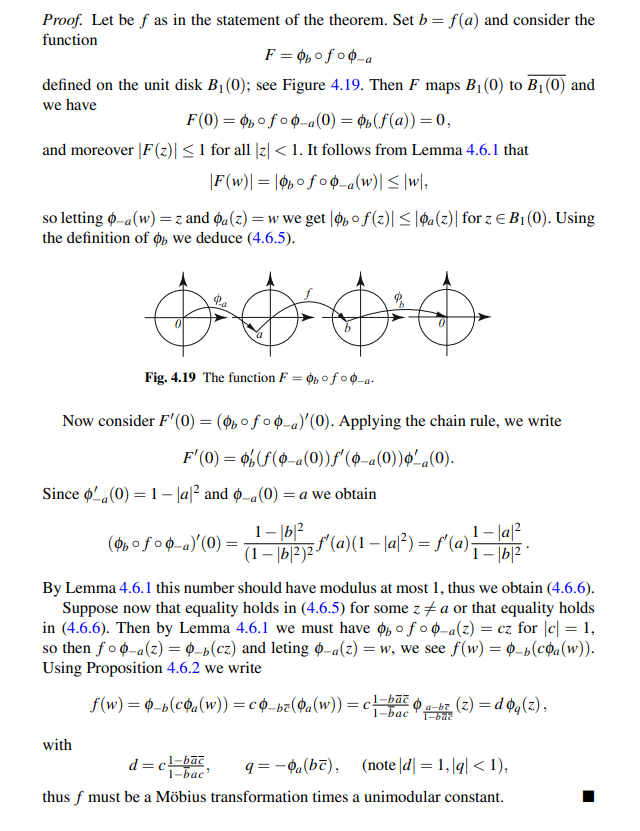

:::{.exercise}
Prove the following:
suppose $\abs{f(z)}\leq 1$, then for all $z, w\in \DD$,
\[
\left|\frac{f(z)-f(w)}{1-\overline{f(w)} f(z)}\right| \leq\left|\frac{z-w}{1-\bar{w} z}\right|
\quad\text{ and }
\left|f^{\prime}(z)\right| \leq \frac{1-|f(z)|^{2}}{1-|z|^{2}}
.\]
If equality holds for some $z\neq w$ in either expression, then $f= \lambda F$ where $F$ is a linear fractional transformation and $\abs{\lambda} = 1$, so $f\in \Aut(\DD)$.

> Note that this does not require $f(0) = 0$.

:::

:::{.proof}

:::
