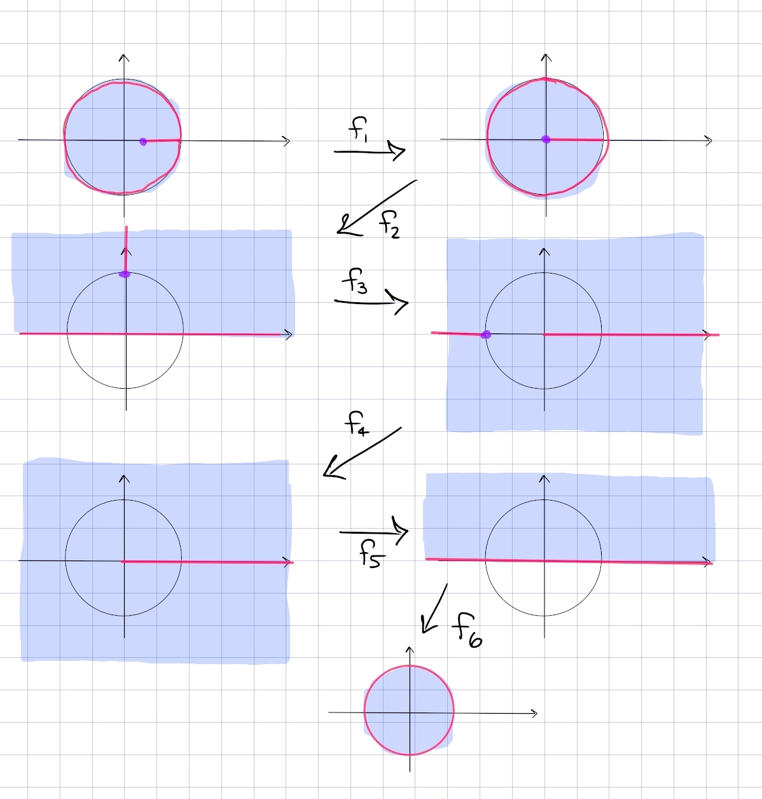

:::{.exercise title="Disc minus a slit"}
Find a conformal map
\[
\DD\sm \left[ {1\over 2}, 1\right) \to \DD
.\]

#complex/exercise/completed

:::

:::{.solution}
The picture:

In steps:

- $f_1$: send $1/2\to 0$ and $1\to 1$ in order to lengthen the slit.
  Mobius transformations preserve lines, so take $f_1(z) = {z-1/2 \over 1-1/2}$.
  New domain: $\DD\sm [0, 1)$.

- $f_2$: send $\DD\to \HH$ and keep track of the slit.
  Use the standard inverse to the Cayley transform, $f_2(z) = i{1-z\over 1+z}$.
  New domain: $\HH\sm [i, i\infty)$, noting that $\HH$ is the open half-plane.

- $f_3$: rotate the slit so it becomes a line segment from $-1$ to $1$ passing through $\infty$.
  Use $f_3(z) = z^2$.
  New domain: $\CC\sm\qty{(-\infty, 1] \union [1, \infty) }$

- $f_4$: move the slit off to infinity to be left with a ray, so send $-1\to \infty$ and $0\to 0$.
  Take $f_4(z) = {z\over z+1}$, the new domain is $\CC\sm [0, \infty)$.

- $f_5$: fold it back. Branch cut log along $[0, \infty)$ to define $f_5(z) = z^{1\over 2}$, so the new domain is $\HH$.

- $f_6$: apply the standard Cayley transform $f_6(z) = {i-z\over i+z}$
:::

