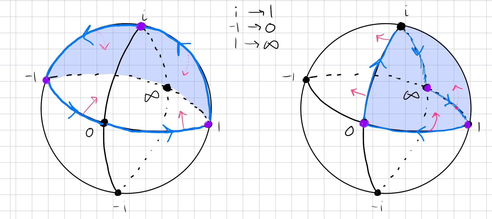

:::{.exercise title="$\mathbb{D}^c \intersect \mathbb{H}$ to $\mathbb{H}$"}
Find a conformal map from $\DD^c \intersect \HH$ to $\HH$ using cross-ratios.

:::

:::{.solution}
Idea: all cross-ratios send the complement of a positively oriented region $(a,b,c)$ to the half-hemisphere $(1,0,\infty)$ on $\CP^1$.
So take $(i, -1, 1)\to (1,0,\infty)$:

This is the cross-ratio
\[
f(z) = {z+1\over z-1} {i-1\over i+1}
.\]

The image of $\DD^c \intersect \HH$ is the 1st quadrant $\HH \intersect \Re(z) > 0$.
Send this to $\HH$ with $z\mapsto z^2$.
:::
