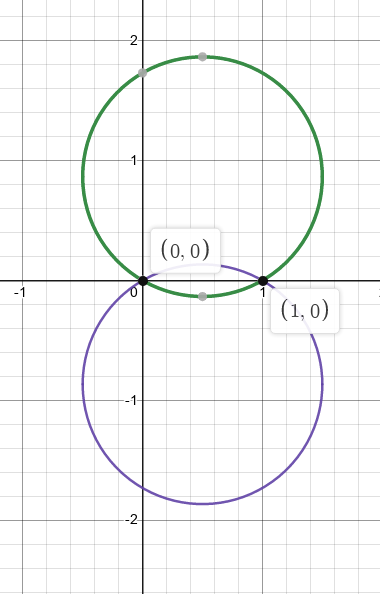
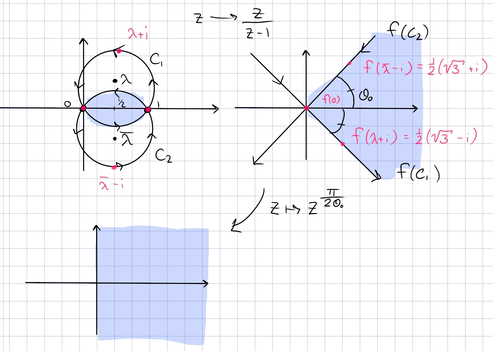

:::{.problem title="?"}
Let $\lambda = {1\over 2}\qty{1 + i \sqrt{3}}$ and find a map 
\[
R \da \ts{\abs{z - \lambda} < 1} \intersect \ts{\abs{z-\bar{\lambda}} < 1 } \too \DD
.\]
:::

:::{.solution}
The region looks like the following:

Following the general strategy for lunar regions, send the intersection points to $0$ and $\infty$ to get triangular sector.
So choose to send $0\to 0$ and $1\to \infty$ by taking
\[
f(z) \da {z\over z-1}
.\]

> Note: mistake here, really we need to compose with $z\mapsto -z$ to get the picture, so take $f(z) \da {z\over 1-z}$ instead!!

:::{.claim}
\[
f(R) = \ts{z\st -\theta_0 < \Arg(z) < \theta_0 },\qquad \theta_0 \da {\pi \over 6}
.\]

:::

From here it is easy to map to the disc:

- $z\mapsto {z\over z-1}$ sends $R$ to $\abs{\Arg(z)} < \theta_0$
- $z\mapsto z^{\pi \over 2\theta_0}$ maps $\abs{\Arg(z)}<\theta_0 \to \abs{\Arg(z)} < {\pi \over 2}$, the right half-plane.
- $z\mapsto iz$ rotates the right half-plane into $\HH$.
- $z\mapsto {z-i\over z+i}$ maps $\HH\to \DD$.

:::{.proof title="of claim"}
Since both $C_1, C_2$ pass through $0, 1$, their images become circles passing through $f(0)=0, f(1) = \infty$, so lines through the origin.
Since $f$ fixes $\RR$ and the original region is symmetric about $\RR$, the resulting region will also be symmetric about $\RR$.
As shown in the picture, since the interior of the region is to the left of each circle, the image will be to the left of each line.
So it suffices to find the orientation of the two lines, as well as the angle that one of them makes with the $x\dash$axis.

Consider $f(C_1)$ -- it suffices to find $\Arg(f(z_0))$ for any $z_0\in C_1$, so look for a point (other than $0, 1$) where $\Arg(f(z_0))$ is easy to compute.
Noting that $C_1$ intersects $i\RR$, we can find this point:
\[
C_1: \qty{ x-{1\over 2}}^2 + \qty{y - {\sqrt 3 \over 2}}^2 &= 1 \\
x=0 \implies y = \pm{1\over 2} \sqrt{3} + {1\over 2} \sqrt{3} = 0, \sqrt{3}
,\]
so choose $z_0 = i\sqrt{3}$:
\[
f(z_0) 
= {i\sqrt 3 \over i\sqrt 3 - 1} = {1\over 4}\qty{3-i\sqrt 3}
\implies \Arg(f(z_0)) = {-\pi \over 6}
.\]
So $C_1$ does get mapped to the line in the image running from $Q_2\to Q_4$.

To get the orientation of $C_1$, use that $i\sqrt{3}, 0, 1$ map to $f(z_0), 0, \infty$, which gives a $Q_4\to Q_2$ orientation -- oops.

> Mistake here: should have chosen $z\mapsto {z\over 1-z}$ to make the picture accurate!

Similarly for $C_2$, setting $z_1 \da -i\sqrt 3$ yields $f(z_1) = {1\over 4}\qty{3+i\sqrt{3}}$, so $\Arg(f(z_1)) = {\pi \over 6}$.
The orientation is found from $1,0,z_0 \mapsto \infty, 0, f(z_0)$, which is $Q_3\to Q_1$.

> Again, mistake in the picture!

Intersecting the regions that are to the left of each image curve yields $5\pi/6 < \Arg(z) < 7\pi/6$, and composing with $z\mapsto -z$ yields $-\pi/6 < \Arg(z) < \pi/6$.
:::

:::

