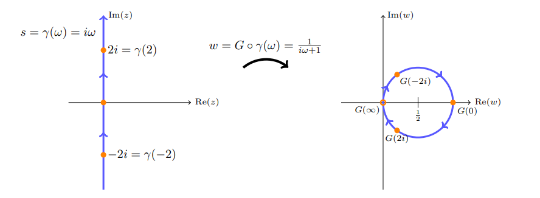

:::{.exercise title="Line to circle"}
Find a conformal map that sends $i\RR$ to $\abs{z-{1\over 2}} = {1\over 2}$.

:::

:::{.concept}
\envlist

- The double angle formulas:
\[
\sin(2t) = {2\tan(t) \over 1+\tan^2(t)} && \cos(2t) = {1-\tan^2(2t) \over 1+\tan^2(t)}
.\]
- Parameterize a line by $x=\tan(t)$ for $t\in (-\pi/2, \pi/2)$
- The methods in SS Theorem 1.2: particularly the boundary behavior of $F(z) \da {i-z\over i+z}$, where $F(\RR) = \ts{\cos(2t)+i\sin(2t) = e^{2it} \st t\in (-\pi/2, \pi/2)}$.

- Nyquist plots: a common applied problem, essentially computing the image $F(i\RR)$.

:::

:::{.solution}
Idea: need the line $-i\infty\to 0 \to i\infty$ to get mapped to a circle $0\to 1\to 0$:

Take the cross ratio $R(z) = (z, 0, \infty, -1)$ to send

- $0\to 1$
- $\infty\to 0$
- $-1\to \infty$

This yields
\[
R(z) = {z-\infty \over z+1}{0+1\over 0-\infty} = {1\over z+1}
.\]
Some deductions:

- $R$ preserves circles, so $\RR\mapsto \RR$. 
  - The segment $0\to\infty\mapsto 1\to 0$
  - The ray $-1\to 0 \to \infty \mapsto \infty\to 1\to 0$
  - The ray $-\infty \to -1 \mapsto 0\to -\infty$

- $R$ preserves angles, to at $w=0$, the image of $i\RR$ must be orthogonal to $\RR$, so it's either a circle or $i\RR$ itself.
- Check $-i\infty \to 0 \to -\infty\mapsto 0\to 1\to 0$, so the image is a circle.
- Parameterize $i\RR = \ts{it\st t\in \RR}$, then compute the image
\[
f(i\RR) 
&= \ts{{1\over 1+it}} \\
&= \ts{1+t\over 1+t^2} \\
&= \ts{{1\over 1+t^2} + i {t\over 1+t^2}} \\
&= \ts{{1\over 2} \qty{ 1 + {1-t^2\over 1+t^2} } + i{1\over 2}\qty{2t\over 1+t^2}} \\
&= \ts{{1\over 2}\qty{1 + \cos(2t) + i\sin(2t)}} \\
&= \ts{{1\over 2} + {1\over 2}e^{2it} }
,\]
which is a circle of radius $1/2$ about $1/2$.

Conclusion:

- $i\RR \to \ts{\abs{z-{1\over 2}} = {1\over 2} }$ by $z\to {1\over 1+z}$.
- The reverse map: $w\mapsto {1-w\over w}$.
:::

