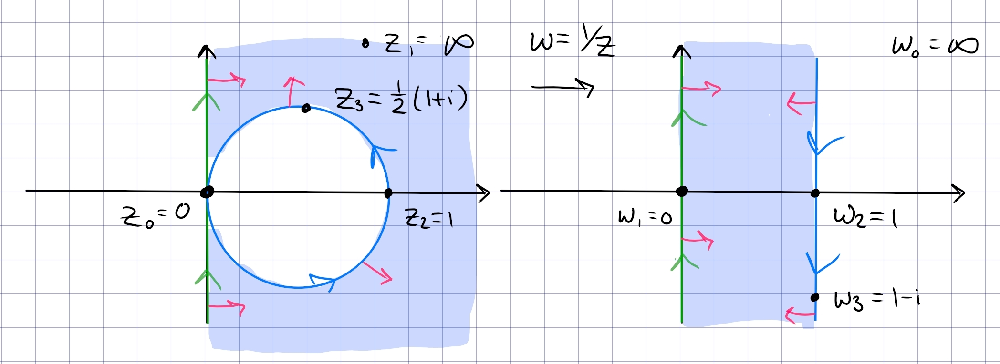
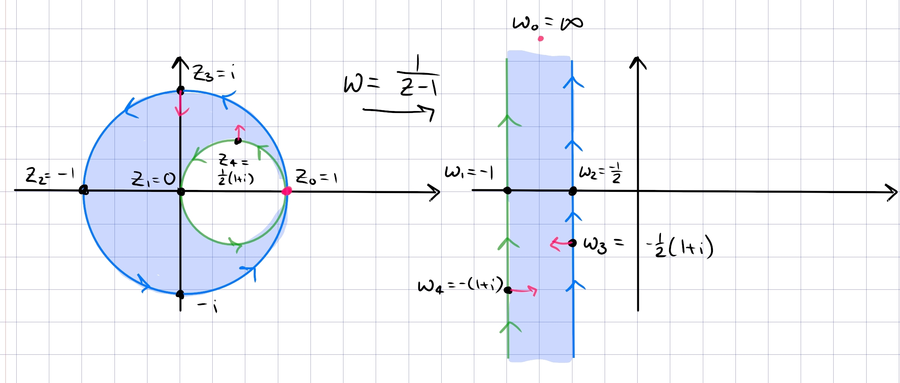
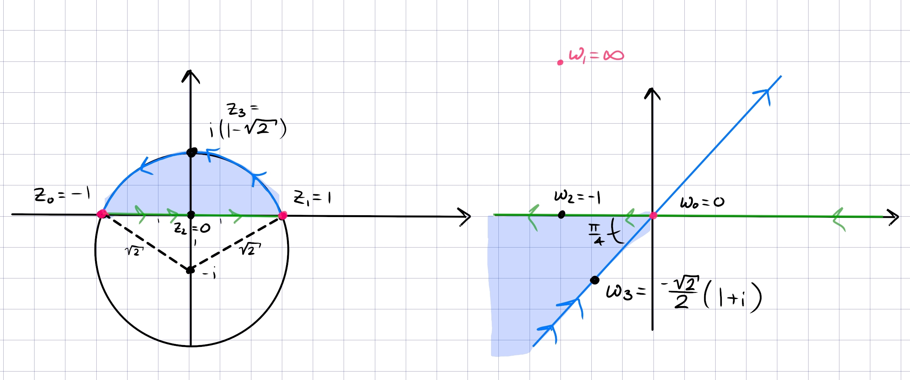
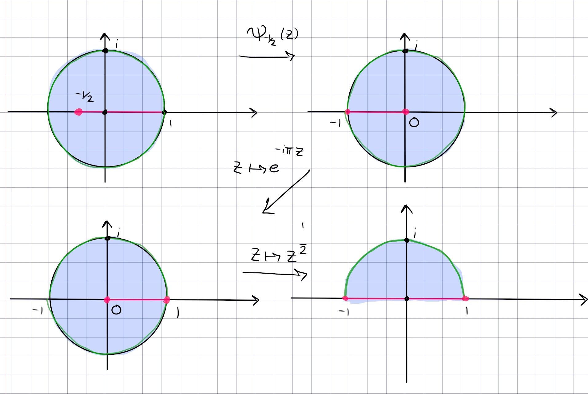

:::{.problem title="?"}
Find a conformal map

1.  from $\{ z: |z - 1/2| > 1/2, \text{Re}(z)>0 \}$ to $\mathbb H$

2.  from $\{ z: |z - 1/2| > 1/2, |z| <1  \}$ to $\mathbb D$

3.  from the intersection of the disk $|z + i| < \sqrt{2}$ with
    ${\mathbb H}$ to ${\mathbb D}$.

4.  from ${\mathbb D}  \backslash [a, 1)$ to
    ${\mathbb D} \backslash [0, 1)$ ($0<a<1)$. 

    > Short solution possible using Blaschke factors.

5.  from $\{ z: |z| < 1, \text{Re}(z) > 0 \} \backslash (0, 1/2]$ to
    $\mathbb H$.

:::

:::{.solution}
**Part 1**:
this is a bigon with vertices $0, \infty$, so send $0\to\infty$ with $1/z$.
Orient $i\RR$ and the circle $S$ positively, note that both will be mapped to generalized circles.
To find the resulting region, use handedness -- it's on the right of $i\RR$ and the right of $S$.
The map preserves $i\RR$ and as $t$ traces out $(-\infty, 0^-, 0^+, \infty)$, $f(it)$ traces out $(0^+, \infty, -\infty, 0^-)$, so this preserves the orientation of $i\RR$.
For $S$, let $z_0\da {1\over 2}(1+i)\in S$, then $f(z_0) = 1-i$.
So the arc $(1,z_0, 0)$ maps to $(1, 1-i,\infty)$, so this is a vertical line through $\Re(z) = 1$ oriented downward.
The region is to the right of $S$, so we have

The rest is standard:

- Dilate and rotate to $0<\Im(z) < \pi$ using $z\mapsto i\pi z$.
- Exponentiate using $z\mapsto e^z$ \to get $\HH$.
- Apply the Cayley map $z\mapsto {z-i\over z+i}$ to get $\DD$.

**Part 2**:
a bigon with vertex $1$, i.e. a lune.
Send $1\to \infty$ with $f(z) \da {1\over z-1}$, and check that

- $1\mapsto \infty$
- ${1\over 2}(1+i) \mapsto -(1+i)$
- $0\mapsto -1$
- $i\mapsto -{1\over 2}(1+i)$
- $-1\mapsto -{1\over 2}$

By tracking tangent/normal vectors, this results in the region $-1<\Re(z) < -{1\over 2}$:

The rest is standard:

- Translate to the right by $z\mapsto z+{1\over 2}$ to get $-{1\over 2}<\Re(z) < 0$.
- Rotate and dilate by $z\mapsto -2i\pi z$ to get $0<\Im(z) < \pi$
- Exponentiate by $z\mapsto e^z$ to get $\HH$,
- Cayley map $z\mapsto {z-i\over z+i}$ to get $\DD$.

**Part 3**:
a bigon in $\HH$ with vertices $\pm 1$, with an arc passing through $z_3 \da i(\sqrt{2} - 1)$.
Take $z\mapsto {z+1\over z-1}$ to obtain

- $-1\mapsto 0$
- $1\mapsto \infty$
- $0\mapsto -1$

:::{.claim}
$z_3\mapsto w_0$ where $\arg(w_0) = -3\pi/4$
:::

:::{.proof title="?"}
Let $z_3 = ic$ where $c\da \sqrt{2} -1$, then
\[
f(z_3) 
&= -{1+z_3\over 1-z_3} \\
&= -{1+ic \over 1-ic} \\
&= -{(1+ic)^2 \over 1+c^2} \\
&= -\qty{ {1-c^2 \over 1+c^2} + i{2c\over 1+c^2} }
.\]
Now check that $c^2 = 3-2\sqrt 2$ and $1-c^2 = -2+2\sqrt{2}$, so
\[
{ 2c\over 1-c^2} = {2(\sqrt 2 - 1) \over -2 + 2\sqrt 2 } = 1
,\]
so the argument is $\arctan(1) = { \pi \over 4}$ or $-{3\pi \over 4}$.
Since $1-c^2>0, 2c>0$, noting the negative sign above, $f(z_3)$ is in $Q_3$, so take $-3\pi \over 4$.
:::

Orienting the bigon positively, we have $(-1, 0, 1)\mapsto (0, -1, \infty)$, i.e. the real axis oriented from $+\infty\to-\infty$.
Similarly $(1, z_3, -1)\mapsto (\infty, \omega_4^3, 0)$, which is a line passing through $\omega_4^3$, oriented from $Q_3\to Q_1$.
Since the original region was on the left of both curves, we get

Now

- Flip this to $Q_1$ with $z\mapsto -z$ to get $0<\Arg(z) < \pi/4$.
- Rotate clockwise with $z\mapsto e^{-i\pi\over 8}$ to get $-\pi/8<\Arg(z) < \pi/8$.
- Dilate the argument to a half-plane with $z\mapsto z^{\pi\over 2\theta_0}$ where $\theta_0 = \pi/8$ to get $-\pi/2<\Arg(z) < \pi/2$.
- Rotate with $z\mapsto iz$ to get $\HH$.
- Cayley map, $z\mapsto {z-i\over z+i}$.

**Part 4**:
See part 5.
The critical step is a Blaschke map $\psi_a$ which sends $a\to 0$.
For $a\in \RR$, $\psi_a(\RR) = \RR$ and this will map the partial slit from $a$ to the boundary to a usual slit from $0$ to the boundary.

**Part 5**:
Dealing with the slit:

- Use a Blaschke factor to send $a\da -1/2\to 0$, so $z\mapsto {a-z\over 1-\bar{a} z}$.
  Checking that $(-1/2, 0, 1)\to (0, -1/2, -1)$, the image is $\DD\sm(-1, 0]$.
- Rotate with $z\mapsto e^{-i\pi}z$ to get $\DD\sm[0, 1)$.
- Unfold with $z\mapsto z^{1\over 2}$ to get $\DD \intersect \HH$, noting that the slit becomes $[-1, 1]$ and is erased here.
- Use $z\mapsto -1/z$ to get $\DD^c \intersect \HH$.
- Use the Joukowski map $z\mapsto z+z\inv$ to map to $Q_{34}$
- Use $z\mapsto -z$ to get $\HH$.

:::

		
		

