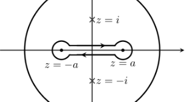

:::{.exercise title="$1/\sqrt{x^2-1}$ "}
\[
I \da \int_0^1 {1\over \sqrt{x^2-1}}\dx = {i\pi \over 2}
.\]

#complex/exercise/completed

:::

:::{.solution}
Write $f(z) = \sqrt{z^2-1} = \sqrt{(z+1)(z-1)}$.
First note $f$ is even, so
\[
I = {1\over 2}I',\qquad I' \da \int_{-1}^1 {1\over \sqrt{z^2-1}} \dz
.\]

Each branch point $\pm 1$ introduces a monodromy factor of $\sqrt{e^{2i\pi}} = e^{i\pi} = -1$, which cancel provided loops are not able to encircle a single branch point. 
So take the branch cut to be the slit $[-1, 1]$, forcing any loop to encircle neither or both of $\pm 1$ -- now use a dogbone contour $\Gamma$ around the slit and apply the residue theorem to the *exterior* region:

The contribution from the top segment $\gamma_1$:
\[
\int_{\gamma_1}f(z)\dz \to \int_1^{-1} {1\over \sqrt{x^2-1}}\dx = -I'
.\]
The contribution from the bottom segment $\gamma_2$:
a monodromy factor of $-1$ is introduced to $g(z)\da \sqrt{z}$ over a path that traces an angle of $2\pi$, so
\[
\int_{\gamma_2}f(z)\dz = \int_{-1}^1 {1\over -\sqrt{x^2-1}} = -I'
.\]

These combine to contribute
\[
\qty{\int_{\gamma_1} + \int_{\gamma_2}}f = -2I'
.\]

Note -- we'll want the contour to actually be positively oriented with respect to $z=\infty$, so we should reverse the orientation of $\Gamma$ to get a total contribution to $2I$ instead.

The contribution from the small circles:
parameterize the first as $-1 + R e^{2\pi i t}$, then
\[
\abs{ \int_{C_\eps^1}f(z)\dz} = \abs{\int_0^1 {2\pi i R e^{2\pi i t}\over \sqrt{ (-1 + R e^{2\pi i t} )^2 - 1 } } \dt} \sim \int_0^1 {R\over \sqrt{R^2-1}} \dt \convergesto{R\to 0} 0
.\]
A similar bound works for the second circle using the parameterization $1+ Re^{2\pi i t}$.

Contributions from residues: take the residue at infinity,
\[
\Res_{z=\infty}f(z) 
&= \Res_{z=0}-{1\over z^2}f\qty{1\over z} \\
&= \Res_{z=0} {-1\over z^2\sqrt{z^{-2} - 1 }} \\
&= \Res_{z=0} {-1\over z\sqrt{1-z^2}} \\
&= \lim_{z\to 0} {-1\over \sqrt{1-z^2}}\\
&= -1
.\]

Putting this together
\[
-2\pi i \Res_{z=\infty}f(z) 
&= \oint_\Gamma f(z)\dz = 2I' \\
\implies 2\pi i &= 2I' \\
\implies \pi i &= I' = 2I \\
\implies I &= {i\pi \over 2}
.\]
:::

