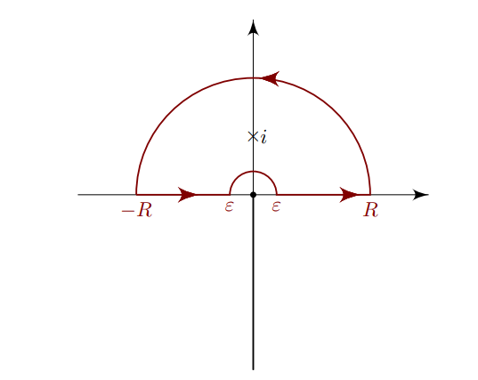

:::{.exercise title="$\log(x) / x^2+a^2$"}
\[
\int_0^\infty {\log(x) \over x^2+a^2}\dx &= {\pi\log(a)\over 2a} && a>0
.\]

:::

:::{.solution title="Semicircle monodromy"}
Note that the poles are at $z=\pm ia$, and since $\lim_{\abs{z}\to\infty}f(z) = 0$ and $\lim{R\to 0} {R\log(R)\over R^2 + a^2} = 0$, an indented semicircular contour will work.

Computing the contribution from the residues:
\[
\Res_{z=ia}f(z) 
&= \lim_{z\to ia }{\log(z) \over (z+ia)} \\
&= {\log(ia) \over 2ia} \\
&= {\log(a) + i\pi/2 \over 2ia} \\
&= {\pi \over 4a} + {\log(a) \over 2ia} \\ \\
\implies 2\pi i \Res_{z=ia}f(z) 
&= {i\pi^2 \over 2a} + {\pi\log(a) \over a}
.\]
The contribution from the integrals will come from $\qty{\int_{\gamma_1} + \int_{\gamma_2}}f$ where

- $\gamma_1 \da \ts{tR + (1-t)\eps \st t\in [\eps, R] }$
- $\gamma_2 \da \ts{t(-\eps) + (1-t)(-R) \st t\in [\eps, R] }$, 

so that the overall contour is oriented counterclockwise.
Noting that $\int_{\gamma_1}f(z)\dz \to I$ the desired integral, the other contribution is
\[
\int_{\gamma_2}f(z)\dz 
&= \int_{-R}^{-\eps} {\log(t)\over t^2 + a^2}\dt \\
&= - \int_{-\eps}^{-R} {\log(t) \over t^2+a^2} \dt \\
&= \int_{\eps}^{R} {\log(-x) \over x^2+a^2} \dt \qquad x=-t,\, \dx = -\dt\\
&= \int_\eps^R {\log(x) \over x^2 + a^2}\dx + i\pi \int_\eps^R {1\over x^2 +a^2}\dx \\
&= I + i\pi\qty{\pi \over 2a}
.\]
In the limit, by the residue theorem we have
\[
{i\pi^2 \over 2a} + {\pi\log(a) \over a}
&= 2I + i\pi\qty{\pi \over 2a} \\
\implies I &= {\pi \log(a) \over 2a}
.\]
:::

