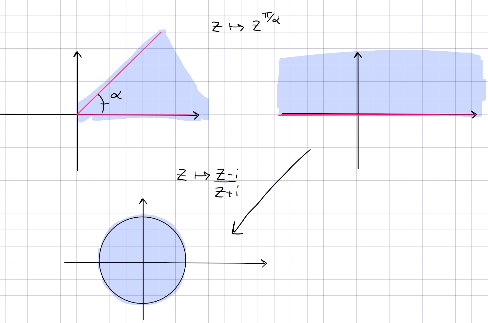

::: {.exercise title="Standard sector"}
Find a conformal map from the sector $\ts{\Arg(z) \in (0, \alpha)} \to \DD$.
:::

::: {.solution}
The picture:

In steps:

- Map the sector to $\HH$ using $z\mapsto z^{\pi/\alpha}$, choosing a branch cut for $\Log$ along $\RR_{\leq 0}$.

- Map $\HH\to \DD$ using the standard $z\mapsto {z-i\over z+i}$.
:::
