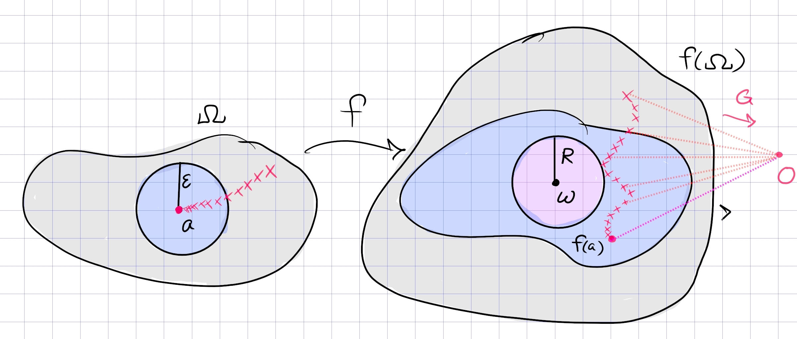

:::{.problem title="?"}
1.
Let $f$ be analytic in $\Omega: 0<|z-a|<r$ except at a
sequence of poles $a_n \in \Omega$ with
$\lim_{n \rightarrow \infty} a_n = a$. Show that for any
$w \in \mathbb C$, there exists a sequence $z_n \in \Omega$ such
that $\lim_{n \rightarrow \infty} f(z_n) = w$.

2.
Explain the similarity and difference between the above assertion and the Weierstrass-Casorati theorem.

> DZG: I think it's also necessary to state that $z_n \to a$.

:::

:::{.solution}

As in the proof of Casorati-Weierstrass, fix $w$ and suppose toward a contradiction that no sequence sequence exists.
Then there is some $\eps, R$ such that 
\[
f(\DD_\eps(a)) \subseteq \DD_R(w)^c
,\]
for otherwise one could construct the desired sequence.
In particular, $\abs{f(z) - w} > R$ for $\abs{z-a} < \eps$, so define
\[
G(z) \da {1\over f(z) - w} \implies \abs{G(z)} \leq R\inv < \infty \qquad \text{in }\DD_\eps(a)
.\]
Since $G$ is bounded in this disc, any singularities here must be removable.
Since the $a_k$ are poles of $f$, they are zeros of $G$ -- this is because if $\abs{f(z)}\to\infty$ as $z\to a_k$ then $\abs{G(z)}\to 0$.
So $G(a_k) = 0$ for all $k$ and $G$ extends holomorphically over the removable singularity $a$, and by continuity must satisfies $G(a) = 0$.
But now $G$ is zero on a set with a limit point, hence $G\equiv 0$ by the identity principle.
This is a contradiction since if $G\equiv 0$ on an open set, $f$ has poles on an open set, contradicting that $f$ is holomorphic on $\Omega$.

The difference to Casorati-Weierstrass: the singularity at $a$ is not essential, since in particular it is not isolated. 
The conclusion is nearly the same though: this says that every $w\in \CC$ is a limit point for $f(\Omega)$, so $w$ is in the closure of $f(\Omega)$, making the image dense in $\CC$.

:::

