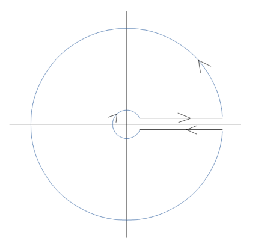

:::{.exercise title="$1/x^4+1$, half-line"}
\[
I \da \int_0^\infty {1\over x^4 + 1 }\dx = {\pi \over 2\sqrt 2}
.\]

:::

:::{.solution title="Integrand symmetry"}
Note that the function is even, so
\[
\int_{0^\infty} f(x) \dx = {1\over 2} \int_\RR f(x)\dx = {1\over 2} {\pi \over \sqrt 2} = {\pi \over 2 \sqrt 2}
,\]
using the solution from a previous problem.
:::

:::{.solution title="Sector"}
A sector will work, since there is a symmetry under $z\to \zeta_4 z$ and $f(z) \sim z^{-4}$, so the semicircular piece will vanish.
Take the contour $\Gamma$ comprised of

- $\gamma_1: \ts{t + 0i \st t\in [0, R]}$,
- $C_R: \ts{Re^{it}\st t\in [0, \pi/2]}$,
- $\gamma_2: \ts{0 + it \st t\in [0, R]}$,

oriented counter-clockwise.
Note that $z^4+1 = \prod_{k=0}^3 (z-\omega \zeta_4)$ where $\omega = e^{i\pi \over 4}$ and $\zeta_4 = e^{2\pi i\over 4} = i$, so there is only one pole at $z_0 \da e^{i\pi\over 4}$ within this contour.

Computing the symmetry:
\[
\int_{\gamma_2} f(z) \dz 
&= \int_R^0 {i \over (ti)^4 + 1}\dt \qquad z=ti,\, \dz = i\dt \\
&= -i \int_0^R {1\over t^4 + 1}\dt \\
&= -i \int_{\gamma_1} f(z) \dz
,\]
so applying the residue theorem and noting that $\int_{C_R}f\to 0$,
\[
2\pi \Res_{z=z_0} f(z) = \int_\Gamma f(z) \dz = \qty{\int_{\gamma_1} + \int_{C_R} + \int_{\gamma_2}}f \too (1-i) I
.\]
Computing the residue:
\[
\Res_{z=z_0}f(z) 
&= {1\over 4z^3}\evalfrom_{z= e^{i\pi \over 4}} \\
&= {1\over 4}e^{-3i\pi \over 4} \\
&= {1\over 4}e^{5i\pi \over 4}
.\]

Thus
\[
I 
&= (1-i)\inv 2\pi i \Res_{z=z_0} f(z) \\
&= \qty{\bar{1-i} \over \abs{1-i}^2} 2\pi i \cdot {1\over 4}e^{5i\pi \over 4} \\
&= {1+i \over 2} {\pi i \over 2}e^{5i\pi \over 4} \\
&= {e^{i\pi \over 4} \over \sqrt{2} } {\pi i \over 2}e^{5i\pi \over 4} \\
&= {\pi i \over 2\sqrt{2}}e^{6i\pi \over 4} \\
&= {\pi i \over 2\sqrt{2}}(-i) \\
&= {\pi \over 2\sqrt{2}} 
.\]

:::

:::{.solution title="The log trick"}
Consider the auxiliary function $g(z) \da \log(z) f(z)$, and take a keyhole contour:

Let $\Gamma$ be the counterclockwise contour consisting of

- $C_\eps = \ts{\eps e^{it}\st t\in [0+\eps, 2\pi - \eps]}$
- $\gamma_+ = \ts{x+i\eps \st x\in [\eps, R]}$
- $C_R= \ts{R e^{it}\st t\in [0+\eps, 2\pi - \eps]}$
- $\gamma_- = \ts{x-i\eps \st x\in [\eps, R]}$

Computing the symmetry:
\[
\int_{\gamma_-}{\log(z) \over z^{4} + 1} \dz 
&= \int_{R}^\eps {\log(x-i\eps) \over (x-i\eps)^4 + 1} \dx \qquad z=x-i\eps, \dz = \dx \\
&\to - \int_{\eps}^R {\log(x) + 2\pi i\over x^4 + 1}\dz \\
&= -\int_{\gamma_+} {\log(z) \over z^4+1}\dz - 2\pi i\int_{\gamma_+} {1\over z^4+1} \dz
,\]
so
\[
\int_{\gamma_+} f + \int_{\gamma_-}f \too -2\pi i I
.\]
By the ML estimate, since $\log(z)/z^4\to 0$ as $\abs{z}\to \infty$, $\int_{C_R}g(z) \to 0$.
Similarly, since $\log(z) / (z^4+1)\to 0$ as $\abs{z}\to 0$, $\int_{C_\eps}\to 0$.
We're then left with the sum of residues at $e^{k i \pi \over 4}$ for $k = 1,3,5,7$.
We have
\[
\Res_{z=z_k} f(z) 
&= {1\over 4z^3}\evalfrom_{z=z_k} \\
&= {z\over 4z^4}\evalfrom_{z=z_k} \\
&= - {z\over 4}\evalfrom_{z=z_k} \qquad \text{ since } z_k^4 = -1 \\
&= -{z_k \over 4}
,\]
so
\[
\Res_{z=z_k}g(z) = -{z_k \over 4}\log(z_k) 
.\]

Now use that in the limit, 
\[
2\pi i \sum_k \Res_{z=z_k}g(z) 
&= \int_\Gamma g(z) \dz \\
&= \qty{\int_{\gamma_+} + \int_{\gamma_i}} f \\
&= -2\pi i I
,\]
so $I = -\sum_k \Res_{z=z_k} g(z)$.

Being very careful to note that we've chosen a branch of $\log$ where $\Arg(z) \in (0, 2\pi)$ in order to get the signs right,
\[
-\sum_k \Res(z=z_k) g(z) 
&= {1\over 4}\qty{ z_1\log(z_1) + z_2\log(z_2)+z_3\log(z_3)+z_4\log(z_4) } \\
&= {1\over 4}\qty{ z_1 {i\pi \over 4} + z_2 {3i\pi \over 4} + z_3 {5i\pi \over 4}+ z_4 {7i\pi \over 4} } \\
&= {i\pi \over 16}\qty{ z_1  + 3z_2  + 5z_3+ 7z_4 } \\
&= {i\pi \over 16}\qty{ \omega \zeta_4^0  + 3\omega\zeta_4^1  + 5\omega\zeta_4^2+ 7\omega \zeta_4^3 } \\
&= {i\pi \omega \over 16}\qty{ 1 + 3i  + -5 + -7i } \\
&= {i\pi \omega \over 16}(-4-4i) \\
&= -{i\pi \omega \over 4}(1+i) \\
&= -{i\pi \omega \over 2}{ \omega \over \sqrt{2} } \\
&= -i\omega^2 {\pi \over 2 \sqrt 2} \\
&= {\pi \over 2\sqrt{2} }
,\]
using that ${\sqrt 2\over 2}(1+i) = e^{i\pi \over 4} = \omega$ and $\omega^2 = i$.

:::

