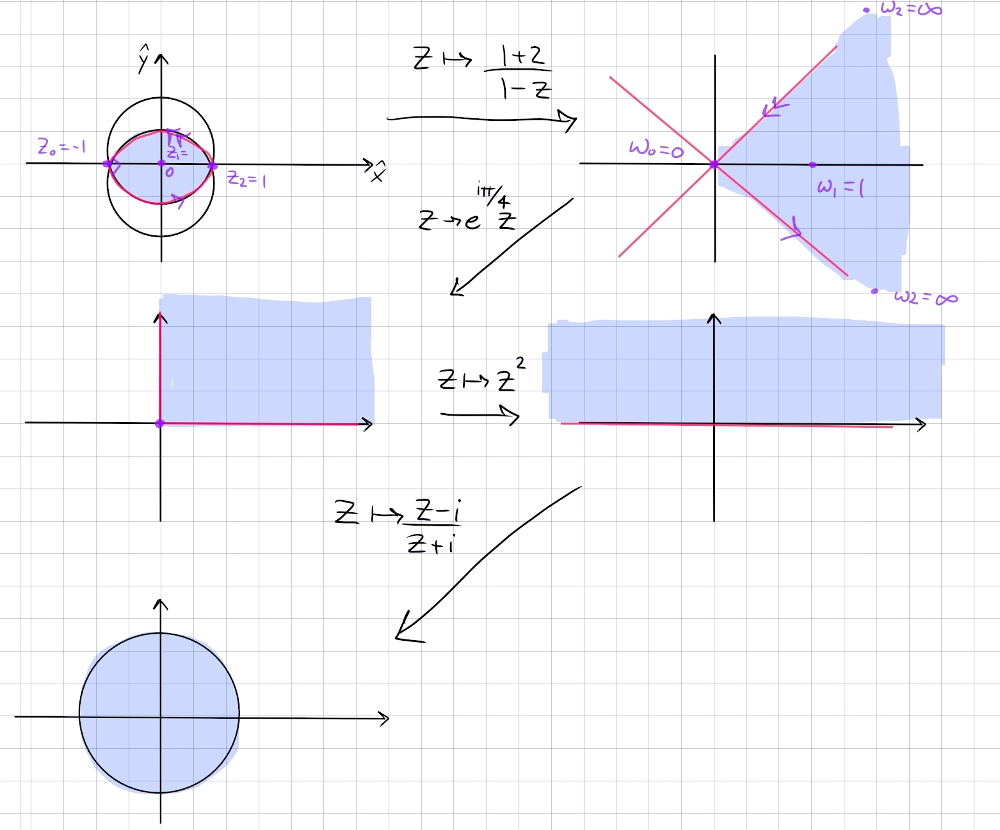

:::{.exercise title="Lune between circles"}

Find a conformal map $L\to \DD$ where
\[
L\da \ts{\abs{z - i } < \sqrt 2} \intersect \ts{\abs{z+i} < \sqrt 2}
,\]
i.e. a lune with vertices $-1$ and $1$.

:::

:::{.solution}
The key insight: for lunes, map the corners to $0$ and $\infty$; this yields a sector.
Here we want $-1\mapsto 0$ and $1\mapsto \infty$, so $f(z) = {z+1\over z-1}$ gets things started.

In steps:

- $z\mapsto {1+z\over 1-z}$ sends the lune to the sector $\Arg(z) \in (-\pi/4, \pi/4)$, since it fixes and must be symmetric about the real axis, and preserves the right angle between the circles at $z=-1$.
- $z\mapsto e^{i\pi/4}z$ to rotate this into $Q_1$.
- $z\mapsto z^2$ to dilate into $\HH$.
- $z\mapsto {z-i\over z+i}$ the standard Cayley map $\HH\to\DD$.

:::

