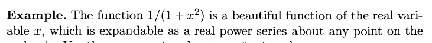
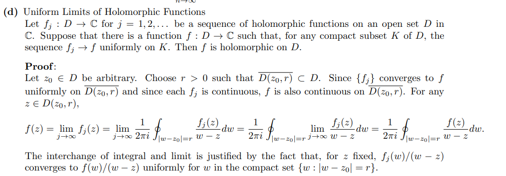

:::{.exercise title="Uniform limit of holomorphic is holomorphic"}
Show that if $f_k\to f$ uniformly on $\Omega$ with $f_k$ holomorphic then $f$ is holomorphic.

#complex/exercise/work

:::

:::{.solution}

Alternatively,

:::
