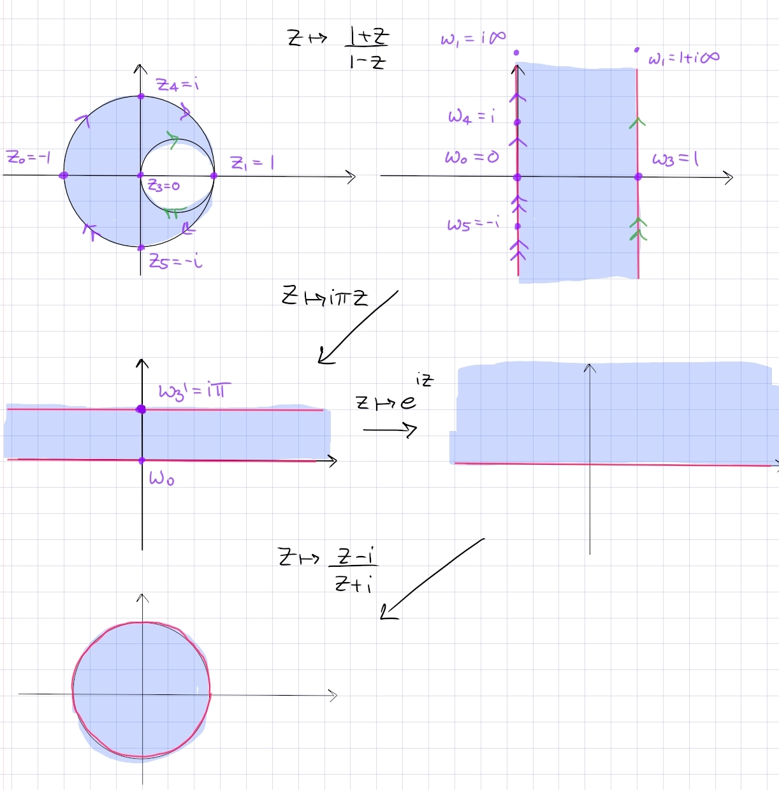

:::{.exercise title="Lune with only one intersection point"}
Find a conformal map:
\[
\DD \sm \ts{\abs{z - {1\over 2}} = {1\over 2} } \to \DD
.\]

:::

:::{.solution}
The picture:

- Key insight: send the point of tangency to $\infty$ to get parallel lines.
  Send $z\mapsto {1+z \over 1-z}$ to send $-1\to 0, 0\to 1, 1\to \infty$ to get a vertical strip.

- Rotate and dilate: $z\mapsto i\pi z$ to get a strip $\RR \cross i(0, \pi)$.
- Standard exponential $z\mapsto e^{iz}$ sends this to $\HH$.
- Standard Cayley $z\mapsto {z-i \over z+i}$ sends this to $\DD$.

:::

