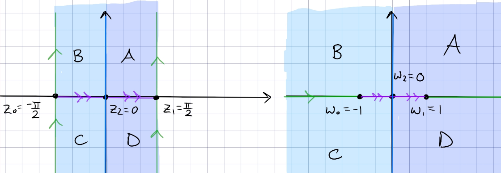

:::{.problem title="?"}
Find the conformal map that takes the upper half-plane conformally onto the half-strip 
\[
\ts{w=x+iy \st -\pi/2 < x < \pi/2,\, y>0}
.\]
:::

:::{.solution}
It's well known that $z\mapsto \sin(z)$ sends $-\pi/2<\Re(z) < \pi/2$ with $\Im(z) > 0$ to $\HH$:

So take $z\mapsto \arcsin(z)$.

:::

