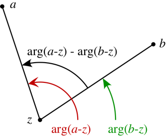
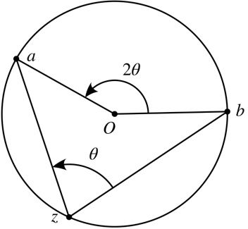

:::{.exercise title="?"}
Fix $a,b\in \CC$ and $\theta$, and describe the locus
\[
\ts{z\st \Arg\qty{z-a\over z-b} = \theta}
.\]

:::

:::{.solution}
The geometry at hand:

By the inscribed angle theorem, this locus is an arc of a circle whose center $O$ is the point for which the angle $aOb$ is $2\theta$:

:::

