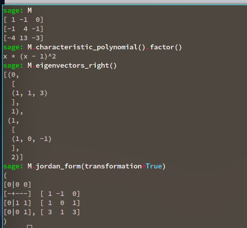

:::{.exercise title="?"}
Compute $\JCF(A)$ for 
\[
A \da 
\mattt{1}{-1}{0}{-1}{4}{-1}{-4}{13}{-3}
.\]

:::

:::{.solution}

- $\det(A) = 0$
- $\tr(A) = 2$
- $\tr(\Extpower^2 A) = 1$
- $\chi_A(t) = t^3 - 2t^2 + t$
- $e_1 = \tv{1,1,3}$
- $e_2 = \tv{1,0,-1}$
  - $e_{2, 1} = \tv{-3,-1, 0}$.

:::

