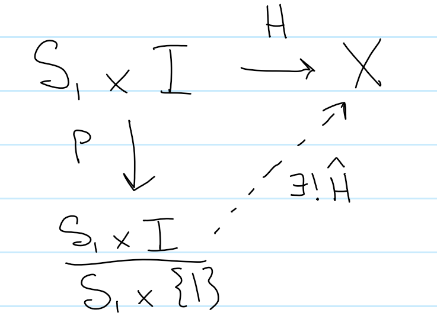

::: problem
2. **Main Idea** Homotopies on maps $S^1\into X$ are cylinders, find a way to continuously map a cylinder onto a disk given the existence of such a homotopy.
   Let $X$ be path connected, $\pi_1(X) = 0$, and let $f:S^1 \into X$ be arbitrary.
   Then $f(S^1) \subseteq X$ is a path in $X$, and since $\pi_1(X) = 0$, this path is homotopic to a point $x_0$.
   So $f$ is homotopic to the constant map $c_{x_0}: S^1 \into X, z \mapsto x_0$.

So let $H:S^1 \cross I \into X$ be this homotopy.
We know that $H(z, 0) = f(z)$ and $H(z, 1) = c_{x_0}(z) = x_0$.

Claim: Consider quotient $\frac{S^1\cross I}{S^1 \cross \theset{1}}$ with the projection map $p: S^1 \cross I \into S^1 \cross \theset{1}$.
Then $H$ factors through the quotient uniquely (why?), and there exists a unique $\hat H$ making this diagram commute:

This follow from the universal property of the quotient in $\mathbf{Top}$, where it is sufficient that $H$ is constant on $S^1 \cross \theset{1}$ - but this is exactly what was deduced above.

However, the quotient object constructed is homeomorphic to $D^2$, as per the following diagram

Here, we just recognize that $S^1 \cross I$ is a cylinder, and quotienting at the $t=1$ point in $I$ simply collapses the top portion of the cylinder to a point, forming a cone.
We then take the flattening map to just project every point on the cone directly downwards onto the base circle, yielding $D^2$.

(Note: I guess this map can be constructed as $\Phi: S^1 \cross I \into D^2$ where $\Phi(z, t) = z(1-t)$.
Since $t=1$ on $S^1 \cross \theset{1}$, $\Phi(z, 1) = 0$ and this is exactly the kernel of $\Phi$.
Continuous as product of continuous functions, need to check injective/surjective and show inverse is continuous.)

Need to check injective/surjective, show that kernel is $S^1 \cross 1$, then use first isomorphism theorem.)

But then $\hat H$ is exactly a continuous map from $D^2 \into X$, as desired.
:::
