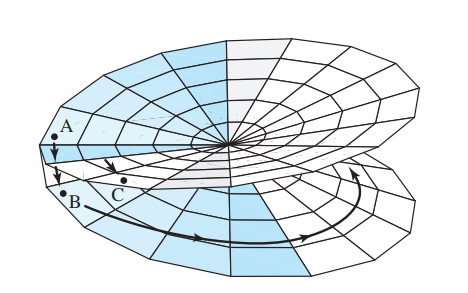

:::{.exercise title="Existence of multiple values in branches"}
Let $z_0 = r_0e^{i\pi} \in (-\infty, 0) \subseteq \RR$, and show that $z^{1\over 2}$ is not continuous along $(-\infty, 0)$ by computing
\[
\lim_{z\in \gamma_1} f_1(z) &= i\sqrt{r_0} \\
\lim_{z\in \gamma_2} f_1(z) &= -i\sqrt{r_0}
,\]

where

- $\gamma_1 = \ts{r_0 e^{it} \st t\in (0, \pi) }$,
- $\gamma_2 = \ts{r_0 e^{-it} \st t\in (\pi, 0) }$

:::

:::{.solution}
\[
\lim _{(r, \theta) \rightarrow\left(r_{0}, \pi\right)} f_{1}\left(r e^{i \theta}\right) &=\lim _{(r, \theta) \rightarrow\left(r_{0}, \pi\right)} r^{\frac{1}{2}}\left(\cos \frac{\theta}{2}+i \sin \frac{\theta}{2}\right)=i r_{0}^{\frac{1}{2}}, \quad \text { and } \\
\lim _{(r, \theta) \rightarrow\left(r_{0},-\pi\right)} f_{1}\left(r e^{i \theta}\right) &=\lim _{(r, \theta) \rightarrow\left(r_{0},-\pi\right)} r^{\frac{1}{2}}\left(\cos \frac{\theta}{2}+i \sin \frac{\theta}{2}\right)=-i r_{0}^{\frac{1}{2}} .
.\]

:::
