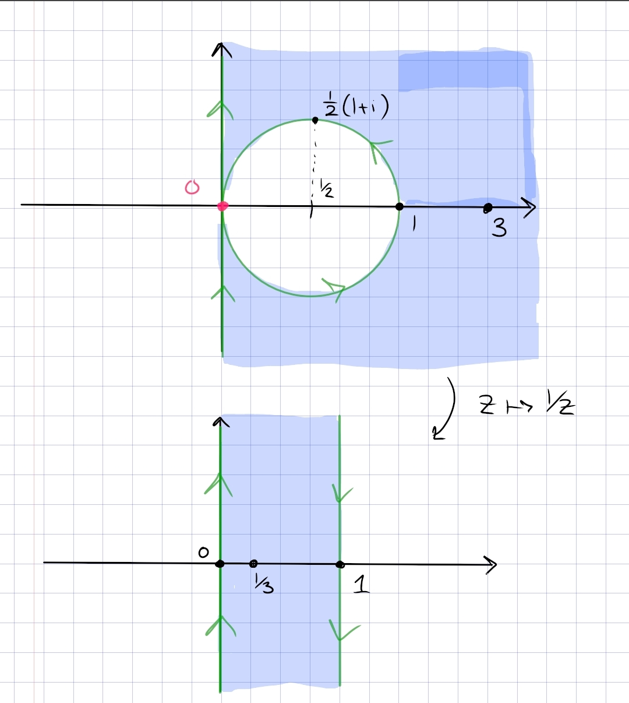

:::{.problem title="Spring 2020.5"}
Find a conformal map that maps the region 
\[
R = \ts{z \st \Re(z) > 0,\, \abs{z - {1\over 2} }> {1\over 2} }
\]
to the upper half plane.
:::

:::{.problem title="Spring 2019.6"}
Find a conformal map from 
\[
\ts{ z\st  \abs{z -1 / 2} >1 / 2, \Re(z)>0 }
\]
to $\mathbb{H}$.

:::

:::{.solution}
The main step: blow up the tangency.

The individual maps:

- Send $0\to \infty$ by $z\mapsto {1\over z}$ to map $R$ to $0<\Re(z)<1$
- Rotate with $z\mapsto iz$ to map this to $0< \Im(z) < 1$
- Dilate by $z\mapsto \pi z$ to get $0 < \Im(z) < \pi$
- Apply $z\mapsto e^z$ to map to $\HH$.

That steps 1 and 2 work requires a bit of analysis.
Use that $f(z) \da 1/z$ satisfies $f(\RR) = \RR$ and $f(i\RR) = i \RR$.
To see where the circle $C_1$ gets mapped to, parameterize it as
\[
\gamma(t) \da \ts{{1\over 2}\qty{1+e^{it}} \st t\in [-\pi, \pi]}
.\]

Now computing its image:
\[
f(\gamma(t)) 
&= {2 \over 1 + e^{it}} \\
&= {2e^{-it\over 2} \over e^{-it\over 2}(1 + e^{it})} \\
&= {2e^{-it} \over e^{-it\over 2} + e^{it\over 2} } \\
&= { 2e^{-it\over 2} \over 2\cos\qty{t\over 2} } \\
&= \sec\qty{t\over 2}\qty{\cos\qty{-t\over 2} + i\sin\qty{-t\over 2}} \\
&= \sec\qty{t\over 2}\qty{\cos\qty{t\over 2} - i\sin\qty{t\over 2}} \\
&= 1 - i\tan\qty{t\over 2}
,\]
and as $t$ runs from $-\pi$ to $\pi$, $-\tan\qty{t\over 2}$ runs from $+\infty$ to $-\infty$.
So this is a line along $z=1$, oriented top to bottom as in the image.

Similarly, computing $f(i\RR)$: parameterize $\gamma(t) = it$ with $t\in (-\infty, \infty)$, then
\[
f(\gamma(t)) = {1\over it} = -{i\over t}
,\]
and as $t$ runs from $0$ to $\infty$, $-1/t$ runs from $-\infty$ to $0$, and as $t$ runs from $-\infty$ to $0$, $-1/t$ runs from $0$ to $\infty$.
So $f(i\RR)$ is oriented from bottom to top, as in the image.

That the region outside the disc is mapped to the strip shown: points $x\in \RR$ with $\abs{x} > 1$ map to $\abs{x}<1$, which is in the strip.
One can also conclude this by handedness: the original region is on the right with respect to $C_1$ and also on the right with respect to $i\RR$, so the new region should be on the right with respect to both $f(i\RR)$ and $f(C_1)$ with their induced orientations.
:::
