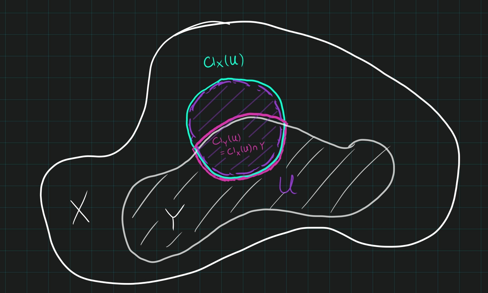

:::{.problem title="Fall 2011"}
Let $X$ be a topological space, and $B \subset A \subset X$. 
Equip $A$ with the subspace topology, and write $\cl_X (B)$ or $\cl_A (B)$ for the closure of $B$ as a subset of, respectively, $X$ or $A$. 

Determine, with proof, the general relationship between $\cl_X (B) \cap A$ and $\cl_A (B)$ 

> I.e., are they always equal? Is one always contained in the other but not conversely? Neither?

:::

:::{.concept}
\envlist

- Definition of closure: for $A\subseteq X$, $\cl_X(A)$ is the intersection of all $B\supseteq A$ which are closed in $X$.
- Definition of "relative" closure: for $A\subseteq Y \subseteq X$, $\Cl_Y(A)$ is the intersection of all $B$ such that $Y\supseteq B \supseteq A$ which are closed in $Y$.
- Closed sets in a subspace: $B' \subseteq Y\subseteq X$ is closed in $Y$ if $B' = B\intersect Y$ for some $B'$ closed in $X$.
:::

:::{.strategy}
What's the picture?
Just need to remember what the closure with respect to a subspace looks like:

:::

:::{.solution}
\envlist

- Claim: $\Cl_X(A) \intersect  Y = \Cl_Y(A)$.
- Write $\Cl_Y(A)$ as the intersection of $B'$ where $Y\supseteq B' \supseteq A$ with $B'$ closed in $Y$.
- Every such $B'$ is of the form $B' = B \intersect Y$ for some $B$ closed in $X$.
- Just identify the two sides directly by reindexing the intersection:
\[
\Cl_Y(A) 
&\da \Intersect_{\substack{ Y\supseteq B' \supseteq A \\ B' \text{ closed in } Y}} B' \\
&= \Intersect_{\substack{ X \supseteq B \intersect Y \supseteq A \\ B \text{ closed in } X}} \qty{ B \intersect Y } \\
&= \qty{ \Intersect_{\substack{ X \supseteq B \intersect Y \supseteq A \\ B \text{ closed in } X}} B} \intersect Y \\ \\
&\da \Cl_X(A) \intersect Y
.\]

:::
