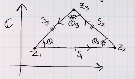

:::{.problem title="?"}
Prove that the distinct complex numbers $z_1, z_2, z_3$ are the vertices of an equilateral triangle if and only if
\[
z_{1}^{2}+z_{2}^{2}+z_{3}^{2}=z_{1} z_{2}+z_{2} z_{3}+z_{3} z_{1}
.\]
:::

:::{.solution}
$\implies$:
Write the vertices as $z_1, z_2, z_3$ and the sides as

- $s_1 \da z_2-z_1$
- $s_2 \da z_3 - z_2$
- $s_1 \da z_1 -z_3$

Note that $s_i = \pm \zeta_3 s_{i-1}$, dividing yields
\[
{s_2 \over s_3} &= {s_1\over s_2} \\
&\iff s_2^2 - s_1 s_3 = 0 \\
&\iff \left(z_{2}-z_{3}\right)^{2}-\left(z_{2}-z_{1}\right)\left(z_{1}-z_{3}\right)=0 \\
&\iff \left(z_{2}^{2}+z_{3}^{2}-2 z_{2} z_{3}\right)-\left(z_{2} z_{1}-z_{2} z_{3}-z_{1}^{2}+z_{1} z_{3}\right)=0 \\
&\iff z_{1}^{2}+z_{2}^{2}+z_{3}^{2}-\left(z_{1} z_{2}+z_{2} z_{3}+z_{3} z_{1}\right)=0
.\]

$\impliedby$:
We still have $s_i = \theta_i s_{i-1}$ for some angles $\theta_i$
We have

and
\[
{s_1\over s_2} &= {\theta_1 \over \theta_2} \cdot {s_3\over s_1} \\
{s_2\over s_3} &= {\theta_2 \over \theta_3} \cdot {s_1\over s_2} \\
{s_3\over s_1} &= {\theta_3 \over \theta_1} \cdot {s_2\over s_3} 
.\]

Running the above calculation backward yields $s_2/s_3 = s_1/s_2$, and by the 2nd equality above, this forces $\theta_2 = \theta_3$.
Similar arguments show $\theta_1=\theta_2 = \theta_3$ which forces $s_1=s_2 = s_3$.

:::

