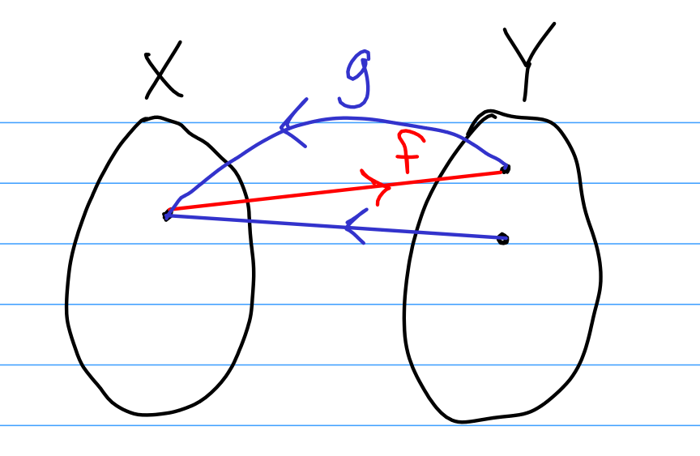

::: problem
1. Parts:

   1. Let $x, y \in X$ and suppose $f(x) = f(y)$.
      By assumption, $g(f(x)) = x$ and $g(f(y)) = y$, and since we also have $g(f(x)) = g(f(y))$ we have $g(f(y)) = x$.
      But $g(f(y)) = y$, so $y=x$.

   2. Let $y\in Y$, we will find an $x\in X$ such that $g(x) = y$.
      We can consider $f(y)$, so let $x = f(y)$.
      We have $g(f(y)) = y$ by assumption, so $g(x) = g(f(y)) = y$ as desired.

   3. We need to have $f$ fail surjectivity and $g$ fail injectivity, so take $X = [1],~ Y = [2]$ where
   $$
   f(1) = 1, \\ 
   g(1) = 1, ~g(2) = 1
   $$
    then $g(f(1)) = 1$, and this exhausts $X$.
   Since $\abs{X} \neq \abs{Y}$, these don't form a bijection -- in particular, $2\not\in\im f \subsetneq Y$.
:::

::: {.solution}
> **AI-Generated Solution** (Gemini 3.7 Flash)

**Goal:** Let $f: X \to Y$ and $g: Y \to X$ be functions such that $g \circ f = \operatorname{id}_X$.
(a) Prove that $f$ is injective.
(b) Prove that $g$ is surjective.
(c) Provide an example showing that $f$ need not be surjective and $g$ need not be injective.

<1>1. Proof that $f$ is injective: Proof: <2>1. Let $x_1, x_2 \in X$ and assume $f(x_1) = f(x_2)$.
<2>2. Apply the function $g$ to both sides: $g(f(x_1)) = g(f(x_2))$.
<2>3. Since $g \circ f = \operatorname{id}_X$, $g(f(x_1)) = (g \circ f)(x_1) = x_1$ and $g(f(x_2)) = (g \circ f)(x_2) = x_2$.
<2>4. Therefore, $x_1 = x_2$.
By definition, $f$ is injective.

<1>2. Proof that $g$ is surjective: Proof: <2>1. Let $x \in X$ be arbitrary.
We must find an element $y \in Y$ such that $g(y) = x$.
<2>2. Define $y = f(x) \in Y$.
<2>3. Evaluating $g$ at $y$: $g(y) = g(f(x)) = (g \circ f)(x) = \operatorname{id}_X(x) = x$.
<2>4. Since for every $x \in X$ there exists $y = f(x) \in Y$ with $g(y) = x$, $g$ is surjective.

<1>3. Counterexample to surjectivity of $f$ and injectivity of $g$: Proof: <2>1. Let $X = \{1\}$ and $Y = \{1, 2\}$.
<2>2. Define $f: X \to Y$ by $f(1) = 1$.
Define $g: Y \to X$ by $g(1) = 1$ and $g(2) = 1$.
<2>3. Check composition: $(g \circ f)(1) = g(f(1)) = g(1) = 1 = \operatorname{id}_X(1)$, so $g \circ f = \operatorname{id}_X$ holds.
<2>4. $f$ is not surjective because $2 \in Y$ but $2 \notin \operatorname{im}(f) = \{1\}$.
<2>5. $g$ is not injective because $g(1) = g(2) = 1$ but $1 \neq 2$.
Q.E.D.
:::
