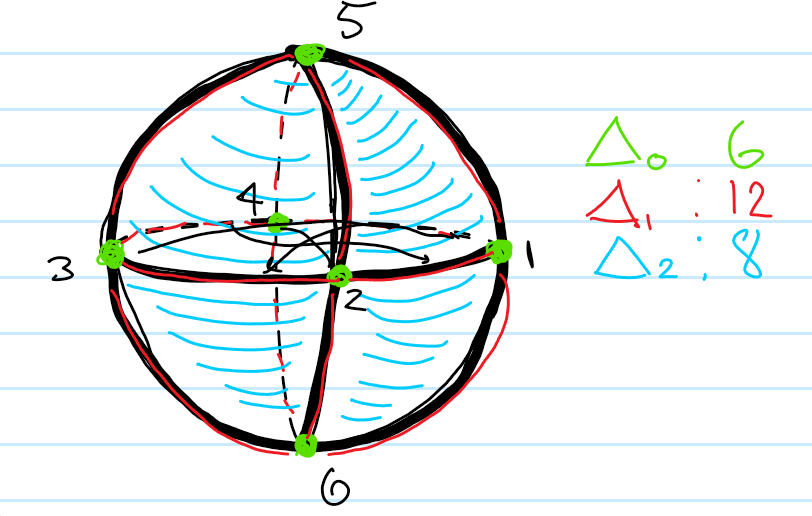

2. $S^2$
  
  So we have
  $C_0 = 1,2,3,4,5,6$
  $C_1 = 12,14,15,16,23,25,26,34,35,36,45,46$
  $C_2 = 126, 236, 346, 146, 125, 235, 345, 145$

  $C_3 = \emptyset$

  And $0 \xrightarrow{\del_3} C_2 \xrightarrow{\del_2} C_1 \xrightarrow{\del_1} C_0 \xrightarrow{\del_0} 0 \cong 0 \xrightarrow{\del_3} \ZZ^{8} \xrightarrow{\del_2} \ZZ^{12} \xrightarrow{\del_1} \ZZ^{6} \xrightarrow{\del_0} 0$
  We have $\del_1([ij]) = j-i$ and $\del_2([ijk]) = jk -ik +ij$.

  We know in advance we should have $\prod H_n = (\cdots,0, \ZZ, 0, \ZZ)$.
  
  For $H_0 = \frac{\ker \del_0}{\im \del_1} = \frac{C_0}{\left<\theset{j-i \mid i < j}\right>}$. In the quotient, we see $1=6=3=2=5=4$ by just taking the indicated walk on the graph, so there is one generator in the quotient and $H_0 \cong \ZZ$.

  For $H_1 = \frac{\ker \del_1}{\im \del_2}$, we just note that there are 6 2-cycles, so each are in the kernel of $\del_1$, but each of them comes from a 2-cell, so is in the image of $\del_2$. So both groups in question are $\ZZ^8$, and the quotient is zero.
  For $H_3 = \frac{\ker\del_2}{\im\del_3}$, since $\im\del_3 = 0$, we can just look at $\del_3([123456]) = 23456 - 13456 + 12456 - 12356 +12346 - 12345$. This is an element (and the only one) that goes to zero under $\del_2$, it generates $\ker\del_2$. So there is one generator, and $H_3 =\ZZ$.

