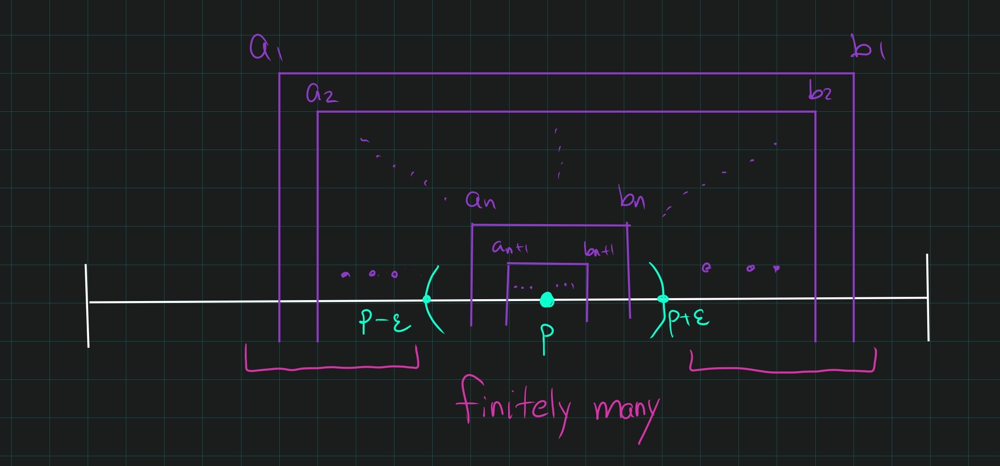

::: {.problem title="Fall 2005"}
Prove that the unit interval $I$ is compact.
Be sure to explicitly state any properties of $\RR$ that you use.
:::

::: {.concept}
\envlist

- Cantor's intersection theorem: for a topological space, any nested sequence of compact nonempty sets has nonempty intersection.

- Bases for standard topology on $\RR$.

- Definition of compactness
:::

::: {.strategy}
What's the picture?
Similar to covering $\ts{1\over n}\union\ts{0}$: cover $x=0$ with one set, which nets all but finitely many points.

Proceed by contradiction.
Binary search down into nested intervals, none of which have finite covers.
Get a single point, a single set which eventually contains all small enough nested intervals.
Only need finitely many more opens to cover the rest.
:::

::: {.solution}
\envlist

- Toward a contradiction, let $\theset{U_\alpha} \covers [0, 1]$ be an open cover with no finite subcover.

- Then either $[0, {1\over 2}]$ or $[{1\over 2}, 1]$ has no finite subcover; WLOG assume it is $[0, {1\over 2}]$.

- Then either $[0, {1\over 4}]$ or $[{1\over 4}, {1\over 2}]$ has no finite subcover

- Inductively defining $[a_n, b_n]$ this way yields a sequence of compact nested intervals (each with no finite subcover) so Cantor's Nested Interval theorem applies.

- Since $\RR$ is a complete metric space and the diameters $\diam([a_n, b_n]) \leq {1 \over 2^n} \to 0$, the intersection contains exactly one point.

- Since $p\in [0, 1]$ and the $U_\alpha$ form an open cover, $p\in U_\alpha$ for some $\alpha$.

- Since a basis for $\tau(\RR)$ is given by open intervals, we can find an $\eps>0$ such that $(p-\eps, p+\eps) \subseteq U_\alpha$

- Then if ${1\over 2^N} < \eps$, for $n\geq N$ we have $$[a_n, b_n] \subseteq (p-\eps, p+\eps) \subseteq U_\alpha.$$

- But then $U_\alpha \covers [a_n, b_n]$, yielding a finite subcover of $[a_n, b_n]$, a contradiction.
:::
