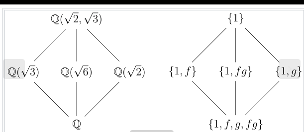

Let $\zeta_n$ denote a primitive $n$th root of 1 $\in \QQ$.
You may assume the roots of the minimal polynomial $p_n(x)$ of $\zeta_n$ are exactly the primitive $n$th roots of 1.

Show that the field extension $\QQ(\zeta_n )$ over $\QQ$ is Galois and prove its Galois group is $(\ZZ/n\ZZ)\units$.

How many subfields are there of $\QQ(\zeta_{20} )$?

:::{.concept}
\envlist

- **Galois** = normal + separable.

- **Separable**: Minimal polynomial of every element has distinct roots.

- **Normal (if separable)**: Splitting field of an irreducible polynomial.

- $\zeta$ is a primitive root of unity $\iff o(\zeta) = n$ in $\FF\units$.
 
- $\phi(p^k) = p^{k-1}(p-1)$

- The lattice: 

  

:::

:::{.solution}
\envlist

Let $K = \QQ(\zeta)$. 
Then $K$ is the splitting field of $f(x) = x^n - 1$, which is irreducible over $\QQ$, so $K/\QQ$ is normal.
We also have $f'(x) = nx^{n-1}$ and $\gcd(f, f') = 1$ since they can not share any roots.

> Or equivalently, $f$ splits into distinct linear factors $f(x) = \prod_{k\leq n}(x-\zeta^k)$.

Since it is a Galois extension, $\abs{\Gal(K/\QQ)} = [K: \QQ] = \phi(n)$ for the totient function.

We can now define maps
\[
\tau_j: K &\to K \\
\zeta &\mapsto \zeta^j 
\]
and if we restrict to $j$ such that $\gcd(n, j) = 1$, this yields $\phi(n)$ maps.
Noting that if $\zeta$ is a primitive root, then $(n, j) = 1$ implies that that $\zeta^j$ is also a primitive root, and hence another root of $\min(\zeta, \QQ)$, and so these are in fact automorphisms of $K$ that fix $\QQ$ and thus elements of $\Gal(K/\QQ)$.

So define a map
\[
\theta: \ZZ_n\units &\to K \\
[j]_n &\mapsto \tau_j
.\]

from the *multiplicative* group of units to the Galois group.

The claim is that this is a surjective homomorphism, and since both groups are the same size, an isomorphism.

:::{.proof title="of surjectivity"}
Letting $\sigma \in K$ be arbitrary, noting that $[K: \QQ]$ has a basis $\theset{1, \zeta, \zeta^2, \cdots, \zeta^{n-1}}$, it suffices to specify $\sigma(\zeta)$ to fully determine the automorphism.
(Since $\sigma(\zeta^k) = \sigma(\zeta)^k$.)

In particular, $\sigma(\zeta)$ satisfies the polynomial $x^n - 1$, since $\sigma(\zeta)^n = \sigma(\zeta^n) = \sigma(1) = 1$, which means $\sigma(\zeta)$ is another root of unity and $\sigma(\zeta) = \zeta^k$ for some $1\leq k \leq n$.

Moreover, since $o(\zeta) = n \in K\units$, we must have $o(\zeta^k) = n \in K\units$ as well. Noting that $\theset{\zeta^i}$ forms a cyclic subgroup $H\leq K\units$, then $o(\zeta^k) = n \iff (n, k) = 1$ (by general theory of cyclic groups).

Thus $\theta$ is surjective.

:::

:::{.proof title="of being a homomorphism"}
\[
\tau_j \circ \tau_k (\zeta) =\tau_j(\zeta^k) = \zeta^{jk} \implies
\tau_{jk} = \theta(jk) = \tau_j \circ \tau_k
.\]

:::

:::{.proof title="of part 2"}
We have $K \cong \ZZ_{20}\units$ and $\phi(20) = 8$, so $K \cong \ZZ_8$, so we have the following subgroups and corresponding intermediate fields:

- $0 \sim \QQ(\zeta_{20})$
- $\ZZ_2 \sim \QQ(\omega_1)$
- $\ZZ_4 \sim \QQ(\omega_2)$
- $\ZZ_8 \sim \QQ$

For some elements $\omega_i$ which exist by the primitive element theorem.
:::

:::

