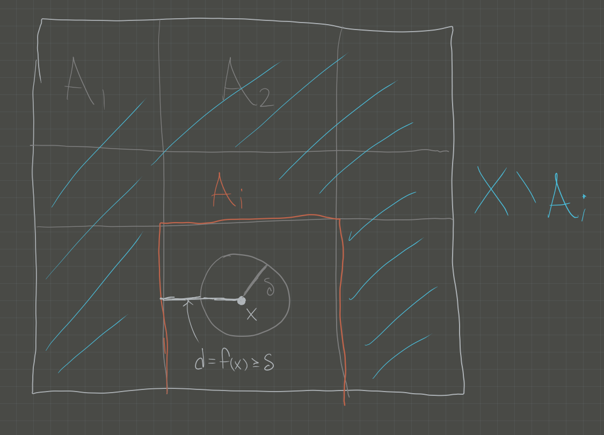

:::{.problem title="?"}
Suppose $(X, d)$ is a compact metric space and $U$ is an open covering of $X$. 

Prove that there is a number $\delta > 0$ such that for every $x \in X$, the ball of radius $\delta$ centered at $x$ is contained in some element of $U$.

:::

:::{.solution}
\envlist

Statement: show that the *Lebesgue number* is well-defined for compact metric spaces.

> Note: this is a question about the *Lebesgue Number*. See Wikipedia for detailed proof.

- Write $U = \theset{U_i \suchthat i\in I}$, then $X \subseteq \union_{i\in I} U_i$. Need to construct a $\delta > 0$.
- By compactness of $X$, choose a finite subcover $U_1, \cdots, U_n$.
- Define the distance between a point $x$ and a set $Y\subset X$: $d(x, Y) = \inf_{y\in Y} d(x, y)$.
  - **Claim**: the function $d(\wait, Y): X\to \RR$ is continuous for a fixed set.
  - Proof: Todo, not obvious.

- Define a function
\begin{align*}
f: X &\to \RR \\
x &\mapsto {1\over n} \sum_{i=1}^n d(x, X\setminus U_i) 
.\end{align*}
  - Note this is a sum of continuous functions and thus continuous.

- **Claim**: $$\delta \definedas \inf_{x\in X}f(x) = \min_{x\in X}f(x) = f(x_{\text{min}}) > 0$$ suffices.
  - That the infimum is a minimum: $f$ is a continuous function on a compact set, apply the extreme value theorem: it attains its minimum.
  - That $\delta > 0$: otherwise, $\delta = 0 \implies \exists x_0$ such that $d(x_0, X\setminus U_i) = 0$ for all $i$.
    - Forces $x_0 \in X\setminus U_i$ for all $i$, but $X\setminus \union U_i = \emptyset$ since the $U_i$ cover $X$.
  - That it satisfies the Lebesgue condition:
  $$\forall x\in X, \exists i \qtext{such that} B_\delta(x) \subset U_i$$
    - Let $B_\delta(x) \ni x$; then by minimality $f(x) \geq \delta$.
    - Thus it can *not* be the case that $d(x, X\setminus U_i) < \delta$ for *every* $i$, otherwise 
    $$f(x) \leq {1\over n}\qty{ \delta + \cdots + \delta} = {n\delta \over n} = \delta$$
    - So there is some particular $i$ such that $d(x, X\setminus U_i) \geq \delta$.
    - But then $B_\delta \subseteq U_i$ as desired.

:::

