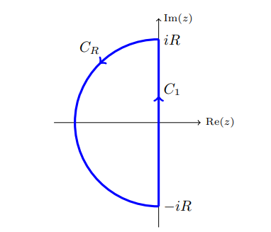

:::{.exercise title="Explicit Rouché, half-plane"}
Find the number of solutions in $\ts{\Re(z) \leq 0}$ of
\[
-2e^z = z+3
.\]

> Hint: show $h(z) = z + 3 + 2e^z$ has one root in $\ts{ \Re(z) \leq 0}$.

:::

:::{.solution}

Note that $\abs{e^z} = e^{\Re(z)} \leq e^{0} = 1$ since $\Re(z) \leq 0$, so if the equality holds then
\[
\abs{2e^z} = \abs{z+3} \implies \abs{z+3}\leq 2
.\]
So apply Rouché to $\Omega$ the circle of radius 2 centered at $z=-3$.
Write $p(z) \da z+3 + 2e^z$, then

- Big: $F(z) = z+3$, so $\abs{F(z)} = 2$ on $\bd \Omega$.
- Small: $g(z) = 2e^z$, so $\abs{g(z)} = 2e^{\Re(z)} < 2$ in $\Omega$.

Then $Z_p = Z_F = 1$, and any such zero is a solution to the original equation.
:::

:::{.solution title="Alternative"}
Use the following region:

Consider $p(z) \da z+3+2e^z$, take $F(z) \da z+3$ and $h(z) \da 2e^z$ for the perturbation.
On $C_1, z=it$ for $t\in [-R, R]$, so
\[
\abs{F(z)} &= \abs{3+it} \geq 3 \\
\abs{h(z)} &= 2e^{\Re(iy)}=2
,\]
so $\abs{h} < \abs{F}$ here.
On $\abs{z} = R$, $\abs{h(z)} < 2e^{\Re(z)} < 2$ since $\Re(z) < 0$, and $\abs{F(z)} = \bigo(R)$, so for $R\gg 1$ we have $\abs{F} > \abs{h}$ here too.

Thus $Z_{h+F} = Z_f = 1$ in this region, and taking $R\to\infty$ covers all of $\Re(z) \leq 0$.
:::
