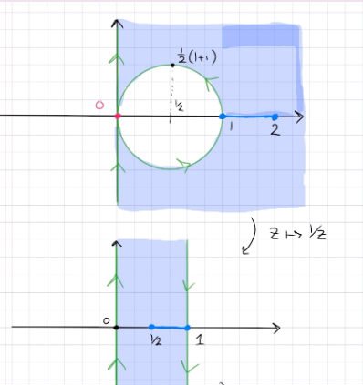

:::{.problem title="?"}
Let $R$ be the intersection of the right half-plane and the outside of the circle $\abs{z - {1\over 2}} = {1\over 2}$ with the line segment $[1, 2]$ removed, i.e. 
\[
R = \ts{z\in \CC\st \Re(z) > 0,\,\, \abs{z-{1\over 2}} > {1\over 2} } \sm \ts{z \da x+iy \st 1\leq x\leq 2,\,\, y=0}
.\]
Find a conformal map from $R$ to $\HH$ the upper half-plane.
:::

:::{.concept}
\envlist

- Blow up the point of tangency: inverting through a circle sends inner circles to lines, fixes the real line, and preserves regions between curves. 
E.g. the image of $\abs{z-i/2} =2$ is $\ts{ \Im(z) = 2}$

- So $z\to 1/z$ maps the region into a half-strip.

:::

:::{.solution}
Note: this seems unusually difficult for a UGA question!
This is a bigon with one vertex $z_2 = 0$, so send it to infinity and keep track of the slit.

In steps:

- Use $z\mapsto 1/z$ to get a vertical strip $0<\Re(z) < 1$, where the slit maps to $[1/2, 1]$.

- Shift and dilate with $z\mapsto \pi(z-1/2)$ to get $-\pi/2<\Re(z) < \pi/2$, where the slit is now at $[0, \pi/2]$.
- Apply $z\mapsto \sin(z)$ to get $\CC\sm[0, 1]$.
- Move the slit with $z\mapsto 4(z-1/2)$ to get $\CC\sm[-2, 2]$.
- Apply $z\mapsto z+z\inv$ to get $\CC\sm\DD$, where the slit is now eliminated.
- Use $z\mapsto 1/z$ to get $\DD$
- Use the inverse Cayley map $z\mapsto i{1-z\over 1+z}$ to get $\HH$.
:::

