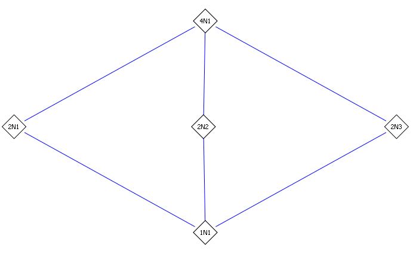

Define
\[
f(x) \da x^4 + 4x^2 + 64 \in \QQ[x]
.\]

a. Find the splitting field $K$ of $f$ over $\QQ$.

b. Find the Galois group $G$ of $f$.

c. Exhibit explicitly the correspondence between subgroups of $G$ and intermediate fields between $\QQ$ and $K$.

:::{.concept}
\envlist

- Useful trick: given $a + \sqrt{b}$, try to rewrite this as $(\sqrt{c} + \sqrt{d})^2$ for some $c, d$ to get a better basis for $\SF(f)$.
:::

:::{.solution}
\envlist

- First consider $g(z) \da z^2 + 4z + 64$.
  Applying the quadratic formula yields
  \[
  z = {-4 \pm \sqrt{16 - 64} \over 2} = -2 \pm {1\over 2}\sqrt{ -15 \cdot 16 } = -2 \pm 2i \sqrt{15}
  .\]
- Substituting $z=x^2$ yields the splitting field of $f$ as $L\da \QQ(\pm \sqrt{ -2 \pm 2i\sqrt{15}})$.

  - Note that this factorization shows that $f$ is irreducible over $\QQ$, since the two quadratic factors have irrational coefficients and none of the roots are real.
  - Irreducible implies separable over a perfect field, so $L/\QQ$ is a separable extension.
  - $L$ is the splitting field of a separable polynomial and thus normal, making $L$ Galois.

- In this form, it's not clear what the degree $[L:\QQ]$ is, so we can find a better basis by rewriting the roots of $g$:
\[
z = -2 \pm 2i\sqrt{15} = \qty{\sqrt{5}}^2 - \qty{\sqrt 3}^2 \pm 2i\sqrt{5}\sqrt{3} = (\sqrt 5 \pm i\sqrt{3})^2
,\]
and so the roots of $f$ are $x = \pm \sqrt{5} \pm i\sqrt{3}$ and $L = \QQ(\sqrt 5, i\sqrt 3)$.

- Counting in towers, 
\[
[L:\QQ] = [\QQ(\sqrt 5, i \sqrt{3} ) : \QQ \sqrt{5} ][\QQ \sqrt{5} : \QQ] = (2)(2) = 4
,\]
where we've used that $\min_{\sqrt 5, \QQ}(x) = x^2-5$ and $\min_{i\sqrt 3, \QQ}(x) = x^2 + 3$, which remains the minimal polynomial over $\QQ(\sqrt 5) \subseteq \RR$ since both roots are not real.

- So $G\da \Gal(L/\QQ) \leq S_4$ is a transitive subgroup of size 4, making it either $C_4$ or $C_2^2$.

- Label the roots:
\[
r_1 &= \sqrt 5 + i\sqrt 3 \\
r_2 &= \sqrt{5} - i \sqrt{3} \\
r_3 &= - \sqrt 5 + i\sqrt 3 = -r_2 \\
r_4 &= -\sqrt{5} - i\sqrt{3} = -r_1
.\]

- We can start writing down automorphisms: 
\[
\sigma_1:
\begin{cases}
\sqrt 5 &\mapsto -\sqrt 5  
\\
i\sqrt 3 &\mapsto i\sqrt 3 .
\end{cases}
&& \sigma_1 \sim (1,3)(2,4)
\\
\sigma_2
\begin{cases}
\sqrt 5 &\mapsto \sqrt 5  
\\
i\sqrt 3 &\mapsto -i\sqrt 3 .
\end{cases}
&& \sigma_2 \sim (1, 2)(3, 4)
.\]
  Note that these define automorphisms because we've specified what happens to a basis and they send roots to other roots.

- Checking that $\sigma_1^2 = \sigma_2^2 = \id$, this produces two distinct order 2 elements, forcing $G \cong C_2^2$ since $C_4$ only has one order 2 element.
  Explicitly, we have
\[
C_2^2 \cong G = \gens{\tau_1, \tau_2} = \ts{\id, \tau_1, \tau_2, \tau_1 \tau_2} = \ts{\id, (1,3)(2,4), (1,2)(3,4),  (1,4)(2,3) }
,\]
  and the generic subgroup lattice looks like:

- Computing some fixed fields.
  Write $i \sqrt{3} = x, \sqrt{5} = y$, then elements in the splitting field are of the form
  $\alpha = 1 + ax + by + cxy$.

  - For $\sigma_1$, we have $x\mapsto -x$, so
  \[
  \sigma_1(\alpha) = 1 - ax + by - cxy
  = \alpha \implies a=-a=0, c=-c=0
  ,\]
  so this preserves $1+by$, making the fixed field $\QQ(1, y) = \QQ(i \sqrt{3})$.

  - For $\sigma_2$, we have $y\mapsto -y$, so
  \[
  \sigma_2(\alpha) = 1 +ax -by -cxy = \alpha \implies b=-b=0,c=-c=0
  ,\]
  preserving $1 + ax$ and making the fixed field $\QQ(1, x) = \QQ(\sqrt 5)$.

  - For $\sigma_1 \sigma_2$, we have $x\mapsto -x$ and $y\mapsto -y$, so
  \[
  \sigma_1\sigma_2(\alpha) = 1 -ax -by +cxy = \alpha \implies a=-a=-, b=-b=0
  ,\]
  preserving $1 + cxy$ and yielding $\QQ(xy) = \QQ(i\sqrt 3 \sqrt 5)$.

- So the lattice correspondence we get here is

\begin{tikzcd}
	&& {\QQ(\sqrt{5}, i\sqrt{3})} \\
	\\
	{\QQ(i \sqrt 3)} && {\QQ(i\sqrt{3}\sqrt{5})} && {\QQ(\sqrt 5)} \\
	\\
	&& \QQ \\
	&& 1 \\
	{} &&&& {} \\
	{\gens{\sigma_1}} && {\gens{\sigma_1\sigma_2}} && {\gens{\sigma_2}} \\
	\\
	&& {G = \gens{\tau_1, \tau_2}}
	\arrow["2"{description}, from=5-3, to=3-1]
	\arrow["2"{description}, from=5-3, to=3-3]
	\arrow["2"{description}, from=5-3, to=3-5]
	\arrow["2"{description}, from=3-3, to=1-3]
	\arrow["2"{description}, from=3-1, to=1-3]
	\arrow["2"{description}, from=3-5, to=1-3]
	\arrow["2"{description}, from=6-3, to=8-1]
	\arrow["2"{description}, from=6-3, to=8-3]
	\arrow["2"{description}, from=6-3, to=8-5]
	\arrow["2"{description}, from=8-1, to=10-3]
	\arrow["2"{description}, from=8-3, to=10-3]
	\arrow["2"{description}, from=8-5, to=10-3]
\end{tikzcd}

> [Link to Diagram](https://q.uiver.app/?q=WzAsMTIsWzIsMCwiXFxRUShcXHNxcnR7NX0sIGlcXHNxcnR7M30pIl0sWzAsMiwiXFxRUShpIFxcc3FydCAzKSJdLFsyLDIsIlxcUVEoaVxcc3FydHszfVxcc3FydHs1fSkiXSxbNCwyLCJcXFFRKFxcc3FydCA1KSJdLFsyLDQsIlxcUVEiXSxbMiw1LCIxIl0sWzAsNl0sWzQsNl0sWzIsNywiXFxnZW5ze1xcc2lnbWFfMVxcc2lnbWFfMn0iXSxbMCw3LCJcXGdlbnN7XFxzaWdtYV8xfSJdLFs0LDcsIlxcZ2Vuc3tcXHNpZ21hXzJ9Il0sWzIsOSwiRyA9IFxcZ2Vuc3tcXHRhdV8xLCBcXHRhdV8yfSJdLFs0LDEsIjIiLDFdLFs0LDIsIjIiLDFdLFs0LDMsIjIiLDFdLFsyLDAsIjIiLDFdLFsxLDAsIjIiLDFdLFszLDAsIjIiLDFdLFs1LDksIjIiLDFdLFs1LDgsIjIiLDFdLFs1LDEwLCIyIiwxXSxbOSwxMSwiMiIsMV0sWzgsMTEsIjIiLDFdLFsxMCwxMSwiMiIsMV1d)

:::

