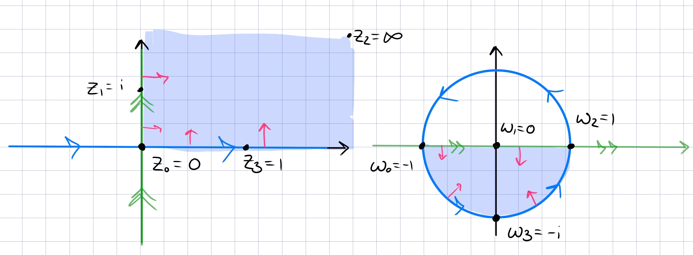

::: {.problem title="?"}
Find a fractional linear transformation $T$ which maps $\HH$ to $\DD$, and explicitly describe the image of the first quadrant under $T$.
:::

::: {.solution}
Unclear to me how to *motivate* this formula, but choose $f(z) = {z-i\over z+i}$.
Note that

- $f(-1) = i$

- $f(0) = -1$

- $f(1) = -i$,

so $\RR$ oriented from $-\infty\to\infty$ is sent to $S^1$ oriented counterclockwise.
Since this is conformal, it preserves handedness -- noting that $\HH$ is on the left with respect to $\RR$, it gets mapped to the left of $S^1$ with its induced orientation, i.e. the interior of $\DD$.
How to remember: $\abs{z-i}<\abs{z+i}$ in $\HH$, since points are closer to $i$ than $-i$.

The image of the first quadrant: the claim is that this is $\DD \intersect Q_{34}$.
Note that parameterizing seems hard!
The naive idea would be to check the image of horizontal lines $t + ci$ for $c$ fixed heights and $t\in (0, \infty)$ the parameterization.
Instead consider handedness and where sub-regions go:

Noting that $Q_1$ is the bigon enclosed by $0, \infty$, this maps to a bigon spanned by $-1, 1$.
By handedness, since $Q_1$ is to the left of $\RR$, it gets mapped to the left of the image of $\RR_{>0}$, which is the lower half of the circle.
:::
