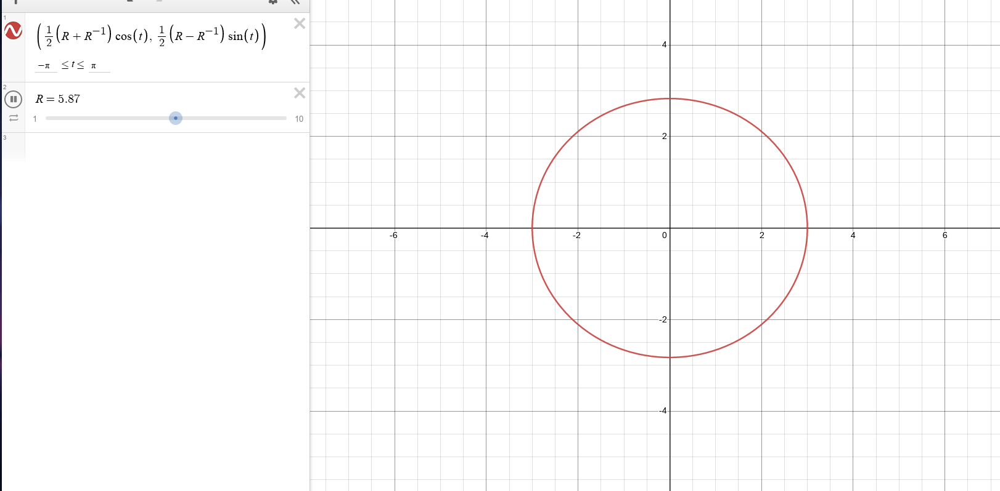

:::{.problem title="?"}
Consider the function $f(z)=\frac{1}{2}\left(z+\frac{1}{z}\right)$ for $z \in \mathbb{C} \backslash\{0\}$. Let $\mathbb{D}$ denote the open unit disc.

a.
Show that $f$ is one-to-one on the punctured disc $\mathbb{D} \backslash\{0\}$. What is the image of the circle $|z|=r$ under this map when $0<r<1$ ?

b.
Show that $f$ is one-to-one on the domain $\mathbb{C} \backslash \mathbb{D}$. What is the image of this domain under this map?

c.
Show that there exists a map $g: \mathbb{C} \backslash[-1,1] \rightarrow \mathbb{D} \backslash\{0\}$ such that $(g \circ f)(z)=z$ for all $z \in \mathbb{D} \backslash\{0\}$. Describe the map $g$ by an explicit formula.

:::

:::{.solution}
**Part a**:
That $f: \CC\smz\to \DD\smz$ is injective: compute the derivative as
\[
f'(z) = {1\over 2}\qty{1 - {1\over z^2}}
,\]
which only vanishes at $z=\pm 1$.
Away from 0 in $\DD$, $f'$ is nonzero and continuous, so by the inverse function theorem $f$ is a local homeomorphism onto its image, and in particular is injective.

The images of circles: parameterize one as $\gamma(t) = Re^{it}$ for $t\in [-\pi, \pi]$.
Note that if $R=1$, $f(\gamma(t)) = {1\over 2}\qty{e^{it} + e^{-it}} = \cos(t)$, so as $t$ increases from $-\pi\to \pi$, the interval $[-1, 1]$ is covered twice.
For $0<R<1$,
\[
f(\gamma(t)) 
&= {1\over 2}\qty{ Re^{it} + {1\over Re^{it}}} \\
&= {1\over 2}\qty{Re^{it} + R\inv e^{-it} } \\
&= {1\over 2}\qty{R\cos(t) + iR\sin(t) + R\inv\cos(-t) + iR\inv\sin(-t) } \\
&= {1\over 2}\qty{R\cos(t) + iR\sin(t) + R\inv\cos(t) - iR\inv\sin(-t) } \\
&= {1\over 2}\qty{R+R\inv}\cos(t) + i{1\over 2}\qty{R-R\inv}\sin(t) \\
&\da H_R \cos(t) + iV_R\sin(t)
,\]
which is generally the equation of an ellipse of horizontal radius $H_R$ and vertical radius $V_R$.
As $R$ varies, these sweep out ellipses of vertical radii from 0 to $\infty$.
One can compute the foci: their distance from $z=0$ is given by $c$, where
\[
c^2 = H_R^2 - V_R^2 = {1\over 4}(R+R\inv)^2 - {1\over 4}(R-R\inv)^2 = 1
,\]
so the foci are all at $\pm 1\in \RR$.
One can check that these are clockwise when $0<R<1$ and counterclockwise when $R>1$.

> In general, you take the coefficient for the major axis squared minus that of the minor axis squared. The foci are along the major axis.

**Part b**:
The claim is that $f(\CC\sm\DD) = \CC\sm[-1, 1]$.

Note that $f(z) = f(1/z)$, so for $z\neq 1/z$ there are exactly two preimages.
These points are exactly $z=\pm 1$, so we need to take the domain $\Omega \da \CC\sm(\DD\union\ts{\pm 1})$ to get injectivity.
Otherwise, for every $z\in \Omega$, exactly one of $z$ or $1/z$ is in $\DD$, so $f(z)$ takes on unique values in $\Omega$.
By part 1, the images of circles of radius $R$ are ellipses, and these sweep out the entire plane outside of $[-1, 1]$:

To be explicit, one can just solve for the two preimages.
Setting $w=f(z)$ and solving for $z$ yields
\[
w &= {1\over 2}\qty{z + {1\over z}} \\
\implies 2wz &= z^2 + 1 \\
\implies z^2 - 2wz + 1 &= 0 \\
\implies z &= {2w \pm \sqrt{4w^2 -4} \over 2} \\
\implies z &= w\pm \sqrt{w^2-1}
,\]
where in order to define $\sqrt{w^2-1}$, one needs a branch cut for $\Log$ along $[-1, 1]$, which is precisely what we're deleting from the image.

**Part c**:
as in a usual conformal map problem, find a map to $\CC\sm[-1,1]\to \DD$.

- Send $-1\to 0$ and $1\to \infty$ with $z\mapsto {z+1\over z-1}$.
  Checking that $f(0) = -1$, this yields $\CC\sm\RR_{\leq 0}$.

- Unwrap with $z\mapsto \sqrt{z}$ to obtain the right half-plane $-\pi/2<\Arg(z) < \pi/2$.
- Apply the rotated Cayley map $z\mapsto {z-1\over z+1}$ to map this to $\DD$.

This composes to 
\[
g(z) &= {\sqrt{z+1\over z-1}  -1 \over \sqrt{z+1\over z-1} +1} \\
&= { \qty{ \sqrt{z+1} - \sqrt{z-1}}^2 \over (z+1)-(z-1) } \\
&= z - \sqrt{z^2-1}
,\]
and checking that it has the right inverse: 
\[
w &= z-\sqrt{z^2-1} \\
\implies (z-w)^2 &= z^2-1 \\
\implies w^2+1 &= 2wz \\
\implies z = {1\over 2}\qty{w + {1\over w}}
.\]

:::

